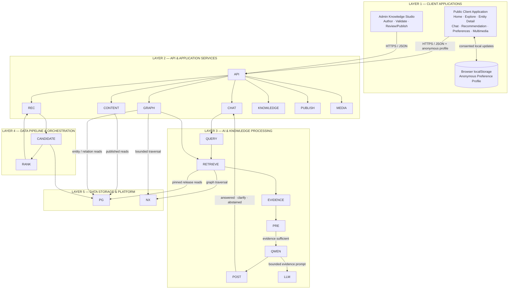

# SYSTEM ARCHITECTURE DOCUMENT — HERITAGEGRAPH

**Capstone Project 1 — C1SE.50**  
**International School, Duy Tan University**

## Document Control

| Field | Value |
|---|---|
| Project | HeritageGraph / CulturalMemoryGraph |
| Version | 1.0 |
| Architecture baseline | 19/09/2026 |
| Feature complete target | 30/11/2026 |
| Final demonstration | 06/12/2026 |
| Project leader | Dương Thanh Hùng |
| Supervisor | ThS. Nguyễn Thị Thanh Tâm |

## Architecture Status Legend

This document describes the **target architecture**. It does not implicitly assert that all components have been implemented.

| Marker | Meaning |
|---|---|
| **AS-BUILT** | Component has code or migration in the repository and has been directly tested |
| **IN PROGRESS** | Component is being developed as part of the current plan |
| **TARGET** | Design of the final product but not yet confirmed as implemented |
| **OPEN DECISION** | Decision to be made by ADR before the designated milestone |

The current repository status at baseline:

- **AS-BUILT:** FastAPI entry point; Chat, Graph, Tour APIs; retrieval/RAG/LLM modules; Next.js Chat UI; PostgreSQL schema and Alembic migrations; evaluation scripts.
- **IN PROGRESS/TARGET:** Admin Knowledge Studio; Airflow DAG; corpus validation/review/publish workflow; complete Public Portal; Recommendation Service; multimedia integration; AWS deployment and full observability stack.
- **OPEN DECISION:** Specific AWS compute for backend/Airflow; this decision must be made by ADR, without altering the boundary logic in the document.

---

# Table of Contents

1. Introduction
   - 1.1 Project Overview
   - 1.2 Purpose
   - 1.3 Business Drivers
2. Architecture Drivers
   - 2.1 Business Constraints
   - 2.2 Technical Constraints
   - 2.3 Functional Requirements
   - 2.4 Quality Attributes
     - 2.4.1 Utility Table
     - 2.4.2 Quality Attribute Scenarios
3. Architecture Overview
   - 3.1 System Context
   - 3.2 Component and Connector View
   - 3.3 Activity Diagrams
   - 3.4 Sequence Diagrams
   - 3.5 Module View
   - 3.6 Allocation View
4. ATAM
   - 4.1 Present the ATAM
   - 4.2 Present the Business Drivers
   - 4.3 Present the Architecture
   - 4.4 Identify the Architecture Approaches
   - 4.5 Create a Quality Attribute Tree
   - 4.6 Analyze the Architectural Approaches
   - 4.7 Brainstorm and Prioritize Scenarios
   - 4.8 Re-analyze the Architectural Approaches
   - 4.9 Present the Results
5. References

## List of Required Figures

| Figure | Title | Status |
|---:|---|---|
| 1 | HeritageGraph System Context | **SOURCE AVAILABLE** — `image.png`; corrections in §3.1 |
| 2 | Layered Component and Connector View | **MERMAID DRAFT READY** — §3.2 |
| 3 | Topic/Location Selection — Activity Diagram | **TO BE DRAWN** — brief in §3.3.1 |
| 4 | Story Detail Search — Activity Diagram | **TO BE DRAWN** — brief in §3.3.2 |
| 5 | Interest-Based Semantic Search — Activity Diagram | **TO BE DRAWN** — brief in §3.3.3 |
| 6 | Natural Language Query — Activity Diagram | **TO BE DRAWN** — brief in §3.3.4 |
| 7 | Admin Login — Activity Diagram | **TO BE DRAWN** — brief in §3.3.5 |
| 8 | Create and Edit Story — Activity Diagram | **TO BE DRAWN** — brief in §3.3.6 |
| 9 | Manage Cultural Content — Activity Diagram | **TO BE DRAWN** — brief in §3.3.7 |
| 10 | Manage Dashboard — Activity Diagram | **TO BE DRAWN** — brief in §3.3.8 |
| 11 | Admin Login — Sequence Diagram | **TO BE DRAWN** — brief in §3.4.1 |
| 12 | Submit Validation and Publish — Sequence Diagram | **TO BE DRAWN** — brief in §3.4.2 |
| 13 | Browse Home, Explore and Entity Detail — Sequence Diagram | **TO BE DRAWN** — brief in §3.4.3 |
| 14 | Grounded Chat Request — Sequence Diagram | **TO BE DRAWN** — brief in §3.4.4 |
| 15 | Recommendation and Profile Update — Sequence Diagram | **TO BE DRAWN** — brief in §3.4.5 |
| 16 | Load 3D/Audio with Graceful Degradation — Sequence Diagram | **TO BE DRAWN** — brief in §3.4.6 |
| 17 | Export or Reset Local Personalization Profile — Sequence Diagram | **TO BE DRAWN** — brief in §3.4.7 |
| 18 | HeritageGraph Module View | **TO BE DRAWN** — brief in §3.5 |
| 19 | HeritageGraph AWS Allocation View | **TO BE DRAWN** — brief in §3.6 |
| 20 | ATAM Quality Attribute Tree | **TO BE DRAWN** — brief in §4.5 |

> **Diagram convention:** Component names, APIs, and datastores in the diagrams must match the documentation. Each diagram should clearly indicate boundaries, direction of connectors, synchronous/asynchronous operations, read/write operations, and target state if not implemented.

---

# 1. Introduction

## 1.1 Project Overview

HeritageGraph is a platform designed to provide a unified point of access for cultural experiences in Hue and Da Nang. It consolidates cultural knowledge from various sources, structured with provenance, and supports user verification of factual claims through citations. The project aims to reduce hallucinations by employing evidence gates and abstention.

## 1.2 Purpose

### For Cultural Knowledge Managers

- Enter and edit knowledge through a user interface instead of using SQL or manually generated UUIDs.
- Link each factual record to its evidence.
- Detect duplicates, type mismatches, missing provenance, and conflicting sources.
- Monitor Airflow validation runs.
- Review and publish a corpus release atomically.
- Track who has modified, reviewed, and published data.

### For the Project Team

- Define boundaries for independent frontend, backend, data, and QA development.
- Prevent mixing draft data with published serving.
- Avoid making the LLM a knowledge store or self-generating sources.
- Provide testable contracts for APIs, corpus versions, evidence, models, and observability.
- Support deployment, rollback, and reproducible demos.

### For Users

- Access a unified point of entry for cultural experiences in Hue and Da Nang.
- Verify factual claims through citations.
- Receive explanations for recommendations.
- Enjoy rich experiences with maps, timelines, 3D, and audio.

## 1.3 Business Drivers

### Business Problems

- Cultural knowledge is scattered across multiple documents, websites, and formats.
- Place names, characters, and artifacts have numerous aliases, variations, and unaccented forms.
- Keyword-based searches fail to represent historical, spatial, and temporal relationships.
- General chatbots are prone to hallucination or providing unverified answers.
- Direct data entry using SQL is cumbersome and prone to foreign key errors and provenance omissions.
- The system lacks a clear process for validating and releasing new knowledge.
- Static cultural content struggles to create engaging explorations.
- Unexplained recommendations reduce reliability.
- Limited quantitative metrics for retrieval, citation, abstention, and latency.

### Business Goals

1. Provide a unified access point for cultural experiences in Hue and Da Nang.
2. Transform source documents into structured knowledge with provenance.
3. Enable users to verify factual claims through citations.
4. Reduce hallucination through evidence gates and abstention.
5. Allow knowledge managers to update data safely without database manipulation.
6. Generate recommendations with explanations based on profiles and graph paths.
7. Present rich content experiences with maps, timelines, 3D, and audio.
8. Deliver a system that can be measured, operated, and rolled back within the Capstone constraints.

### Success Measures

| Measure | Target |
|---|---:|
| Retrieval recall@1 | ≥95% on versioned evaluation set |
| Citation faithfulness | ≥85% |
| Citation coverage | ≥90% |
| Abstention accuracy | ≥90% |
| Recommendation precision@5 | ≥70% on reviewed sample |
| Chat latency p95 | ≤8 seconds in demo environment |

```markdown
| Recommendation latency excluding LLM | ≤2 seconds |
| Published record lacking provenance | 0 |

---

# 2. Architecture Drivers

## 2.1 Business Constraints

| Constraint | Value / Consequence |
|---|---|
| Team | 5 members: AI Backend/Lead, Data & Knowledge, 2 Frontend/UI/UX, QA/Documentation |
| Project start | 27/08/2026 |
| Rebaseline | 19/09/2026 |
| Feature freeze | 28/11/2026 |
| Release candidate | 30/11/2026 |
| Final demo | 06/12/2026 |
| Planned effort | 1,200 person-hours; 240 hours/person; average 16 hours/week/person |
| Budget | USD 5,300; including USD 500 for AWS/API/domain/contingency |
| Geography | Huế and Đà Nẵng |
| Cultural categories | 6 categories of content |
| Corpus target | 80+ documents; balanced minimum by category when possible |
| Delivery strategy | Backend and data on AWS; features complete in November |
| Scope safety | Provenance, publish gate, citation, abstention, evaluation, and privacy are not cut |

## 2.2 Technical Constraints

### Required Stack

| Area | Constraint |
|---|---|
| Frontend | Next.js 14 App Router, React 18, TypeScript |
| Admin UI | Ant Design |
| Public UI | Custom heritage storytelling design system; Ant Design primitives when appropriate |
| Backend | Python 3.12, FastAPI, Pydantic v2, Uvicorn |
| Database | PostgreSQL 16, SQLAlchemy, Alembic |
| Search | PostgreSQL FTS, pg_trgm, pgvector; not calling PostgreSQL FTS BM25 |
| Graph | PostgreSQL source of truth; versioned NetworkX projection |
| Orchestration | Apache Airflow for deep validation/indexing, not for immediate field validation |
| LLM | Qwen3-4B + LoRA; evidence-only generation |
| Inference | MLX base+adapter or llama.cpp GGUF compatible; not directly putting MLX adapter into llama.cpp |
| Object storage | Amazon S3 as canonical MVP store for raw docs, manifests, audio and 3D |
| CI/CD | GitHub, Jenkins, Terraform |
| Observability | Prometheus, Loki, OpenTelemetry + Tempo/X-Ray, Grafana, Langfuse |

### Architecture Constraints

1. PostgreSQL is the source of truth for knowledge, releases, audits, and serving metadata.
2. Online consumers only read the published corpus release.
3. A request must pin the same corpus version for graph, lexical/vector retrieval, and evidence.
4. Published passages are immutable; edits create new revisions.
5. Admin UI and Airflow do not arbitrarily write to production tables; write paths go through FastAPI/service transactions or controlled pipeline contracts.
6. Airflow does not determine truth and does not self-publish.
7. Human reviewers are the final publish gate.
8. Qwen does not query the DB, does not create entities/relations/citations, and does not add knowledge beyond evidence.
9. Graph traversal is limited to 1-2 hops via predicate allowlist.
10. Media failures do not erase text/transcripts.
11. Secrets are not in source control; logs/traces do not contain passwords, tokens, raw IPs, or sensitive PII.
12. Specific AWS compute services are locked by ADR; architecture logic does not depend on ECS, EC2, or a specific container runtime.

## 2.3 Functional Requirements

A comprehensive list of canonical requirements is in `docs/planning-artifacts/epics.md`. The 37 FR are grouped into the following capabilities:

| Capability | FRs | Architectural Owner |
|---|---|---|
| Secure administration and audit | FR01 | Auth/API, Admin Service, audit repository |
| Grounded Vietnamese QA | FR02–FR05 | Chat Service, Evidence Builder, grounding gates |
| Query understanding and planning | FR06–FR08 | Entity Resolver, Intent Router, Query Planner |
| Hybrid and graph retrieval | FR09–FR14 | Retrieval Operators, Graph Service, PostgreSQL/NetworkX |
| Personalization and recommendation | FR15–FR18 | Public Client local profile + stateless Recommendation Service |
| Multimedia heritage experience | FR19–FR21 | Public Portal, Media Service, S3 |
| Guided knowledge authoring | FR22–FR29 | Admin Knowledge Studio, Knowledge Service, PostgreSQL validation |
| Validation and publishing | FR30–FR36 | Airflow, Validation Service, Review/Publish Service |
| Public heritage portal | FR37 | Next.js Public Portal and published-content APIs |

## 2.4 Quality Attributes

### 2.4.1 Utility Table

Evaluation scale: Importance (I) and Difficulty (D) are High (H), Medium (M), Low (L).

| ID | Quality Attribute | Scenario | I | D |
|---|---|---|:---:|:---:|
| QA-01 | Security | Admin login and perform write operations with authorization/audit | H | M |
| QA-02 | Data integrity | Draft does not enter online serving; publish must be atomic | H | H |
| QA-03 | AI trustworthiness | Factual answers have evidence/citation; abstain when evidence is lacking | H | H |
| QA-04 | Performance | Chat p95 ≤8 seconds; recommendation ≤2 seconds | H | H |
| QA-05 | Reliability | Airflow retries do not create duplicate or partial active indices | H | H |
| QA-06 | Availability | Media/external/LLM failures degrade clearly, no blank page | H | M |
| QA-07 | Usability | Admin creates knowledge packages without entering UUID/SQL | H | M |
| QA-08 | Accessibility | Public/Admin/chat/media controls meet WCAG 2.1 AA | M | M |
| QA-09 | Privacy | Consent before local personalization; export/reset device data | H | L |
| QA-10 | Scalability | System absorbs burst read traffic without breaking consistency | M | H |
| QA-11 | Modifiability | Changing model/embedding/operator does not break corpus/evidence contract | M | H |
| QA-12 | Observability | A request/pipeline run is traceable through logs, metrics, and traces | H | M |

### 2.4.2 Quality Attribute Scenarios

#### QA-01 — Security: Administrative Write

| Field | Description |
|---|---|
| Situation | Admin user logs in to create or modify knowledge |
| Source of Stimulus | Admin user |
| Stimulus | Create document, passage, entity, claim, timeline, and evidence |
| Environment | Admin Studio normal operation |
| Artifact | Guided forms, evidence selector, validation UI |
| Response | UI suggests/retrieves foreign records, provides field-specific errors, allows direct passage selection |
| Response Measure | No UUID/SQL required; critical authoring journey fully completed through UI |

#### QA-02 — Data Integrity: Draft Management

| Field | Description |
|---|---|
| Situation | Admin user saves a draft of a document or passage |
| Source of Stimulus | Admin user |
| Stimulus | Save a draft |
| Environment | Admin Studio normal operation |
| Artifact | Guided forms, evidence selector, validation UI |
| Response | UI suggests foreign records, provides field-specific errors, allows direct passage selection |
| Response Measure | No UUID/SQL required; critical authoring journey fully completed through UI |

#### QA-03 — Reliability: Idempotent Pipeline Retry

| Field | Description |
|---|---|
| Situation | Airflow task fails during indexing and is retried |
| Source of Stimulus | Scheduler/operator |
| Stimulus | Retry same submission/revision |
| Environment | Partial staged artifacts exist |
| Artifact | Airflow DAG, validation run, S3 manifest, staging indexes |
| Response | Reuse idempotency key; replace/reconcile staged artifacts; do not activate before review |
| Response Measure | Duplicate knowledge/job = 0; partial release activation = 0 |

#### QA-04 — Availability: Media Dependency

| Field | Description |
|---|---|
| Situation | S3 media, model runtime, or external service is unavailable |
| Source of Stimulus | Infrastructure failure |
| Stimulus | Timeout, 5xx or unavailable object |
| Environment | Public Portal serving users |
| Artifact | Public UI, API, media adapter, inference adapter |
| Response | Text/transcripts remain available; media shows unavailable state; chatbot abstains or reports temporary failure without fabricated response |
| Response Measure | No blank page; no fabricated fallback; failure trace has correlation ID |

#### QA-05 — Usability: Guided Knowledge Authoring

| Field | Description |
|---|---|
| Situation | Knowledge manager adds a new location |
| Source of Stimulus | Admin user |
| Stimulus | Create document, passage, entity, claim, timeline, and evidence |
| Environment | Admin Studio normal operation |
| Artifact | Guided forms, evidence selector, validation UI |
| Response | UI suggests/queries foreign records, provides field-specific errors, allows direct passage selection |
| Response Measure | No UUID/SQL required; critical authoring journey fully completed through UI |

#### QA-06 — Accessibility: Keyboard and Media

| Field | Description |
|---|---|
| Situation | User uses keyboard/screen reader or cannot hear audio |
| Source of Stimulus | End user |
| Stimulus | Navigate portal, chat, citation, and media controls |
| Environment | Desktop/mobile browser |
| Artifact | Next.js UI, map/media controls, transcript |
| Response | Semantic navigation, focus states, labels, reduced motion, and synchronized transcript/fallback |
| Response Measure | WCAG 2.1 AA checks pass for critical flows |

#### QA-07 — Privacy: Consent, Export and Reset Local Profile

| Field | Description |
|---|---|
| Situation | User has not given consent or requests export/reset of personalized profile |
| Source of Stimulus | End user |
| Stimulus | Request export/reset of profile |
| Environment | Any |
| Artifact | User interface, API |
| Response | User interface and API handle consent, export, and reset of personalized data |
| Response Measure | User interface and API handle consent, export, and reset of personalized data |
```

| Source of stimulus | End user |
|--------------------|----------|
| Stimulus            | Local interaction / export / reset request |
| Environment         | Anonymous browser session; public login does not exist |
| Artifact            | Browser `localStorage` preference profile |
| Response            | Do not update profile before consent; export machine-readable JSON; reset delete profile/history on device and revert to cold start |
| Response measure    | Pre-consent local interaction writes = 0; reset verification no longer has personalization key in browser storage |

#### QA-10 — Scalability: Sudden Read Burst

| Field              | Description         |
|--------------------|---------------------|
| Situation          | Number of users reading/querying increases suddenly during demo/event |
| Source of stimulus | Concurrent end users |
| Stimulus            | Burst Home/Explore/Detail/chat requests |
| Environment         | Published release remains unchanged |
| Artifact            | Web/API containers, caches/indexes, RDS connection pool, inference queue |
| Response            | Scale stateless API/web replicas where available; protect database/model with pooling, limits and backpressure |
| Response measure    | No cross-version response; bounded queue; measured latency/error remains within approved degraded threshold |

#### QA-11 — Modifiability: Model or Embedding Change

| Field              | Description         |
|--------------------|---------------------|
| Situation          | Team upgrades model, adapter or embedding dimension |
| Source of stimulus | AI/Data team        |
| Stimulus            | New model release manifest |
| Environment         | Existing published corpus active |
| Artifact            | Inference adapter, prompt, embedding contract, indexes |
| Response            | Build new artifacts side-by-side, run regression evaluation, promote only after gates pass, retain rollback |
| Response measure    | Active release unaffected during build; model/prompt/corpus hashes recorded; rollback tested |

#### QA-12 — Observability: End-to-End Diagnosis

| Field              | Description         |
|--------------------|---------------------|
| Situation          | Chat response is slow or citation gate fails |
| Source of stimulus | Alert, QA or user report |
| Stimulus            | Investigation using request/run ID |
| Environment         | Staging/demo        |
| Artifact            | Metrics, logs, service traces, Langfuse trace |
| Response            | Correlate API, retrieval, DB, inference, evidence and gate spans without exposing secrets/PII |
| Response measure    | Root stage identified from one correlation ID within operational review time |

---

# 3. Architecture Overview

## 3.1 System Context

### Context Description

Figure 1 uses file source `image.png` at the root of the repository. The diagram correctly identifies three external entities: `User`, `Admin`, and `AI / LLM Service`.

| Actor/System | Inputs to HeritageGraph | Outputs from HeritageGraph |
|--------------|------------------------|-----------------------------|
| User         | Topic/Location Selection Request; Story Detail Search; Interest-Based Semantic Search Query; Natural Language Query | Ranked Personalized Search Results; Story Content (Milestones, Hotspots, Citations); AI-generated Answer with Citations |
| Admin        | Login Request; Create and Edit Story; Manage Cultural Content Request; Manage Dashboard | Login Response; Generated Result; Story Validation/Publication Status; Dashboard Overview Data |
| AI / LLM Service | Generated Personalized Answer; Extracted Information | Content Analysis Request; Answer Generation Request |

### Corrections Required for Figure 1

1. Change the circle `System` to a boundary/box `HeritageGraph System` to differentiate inside/outside.
2. `AI / LLM Service` should use an external system symbol, not the same symbol as Actor.
3. Change legend `Interation` to `Interaction`.
4. Merge the two overlapping connectors `Ranked Personalized Search Results` into one.
5. Remove `Authenticate Result` sent to User as Figure 1 does not have a User Login Request and public users are not required to log in.
6. Admin still has `Login Request`/`Login Response`; authentication is required only for Admin.
7. Recommendations for User come from Recommendation Service; AI/LLM only support answer generation and content-analysis suggestions, not publishing decisions.

> **FIGURE 1 — EXISTING SYSTEM CONTEXT TO CORRECT**
>
> Keep the three entities and canonical connectors in the table above. Do not add AWS, database, Airflow, CI/CD, or observability to Figure 1 as they belong to C&C/Allocation, not System Context chosen by the group.

## 3.2 Component and Connector

### Required Layer Layout

C&C must be presented as layers viewed from top to bottom. **Public Client Application and Admin Application are placed next to each other in the first layer**, not combined into a Web UI box. Services and AI/LLM are two separate layers.

```text
┌────────────────────────────────────────────────────────────────────┐
│ LAYER 1 — CLIENT APPLICATIONS                                      │
│  ┌──────────────────────────┐   ┌───────────────────────────────┐  │
│  │ Public Client Application│   │ Admin Knowledge Studio        │  │
│  │ Home/Explore/Detail/Chat │   │ Author/Validate/Review/Publish│  │
│  └──────────────────────────┘   └───────────────────────────────┘  │
└───────────────────────────────┬────────────────────────────────────┘
                                │ HTTPS/JSON
┌───────────────────────────────▼────────────────────────────────────┐
│ LAYER 2 — API & APPLICATION SERVICES                              │
│ FastAPI/Auth │ Public Content │ Chat │ Graph │ Recommendation      │
│ Knowledge │ Validation & Publishing │ Media                       │
└────────────────────────────────────────────────────────────────────┘

┌────────────────────────────────────────────────────────────────────┐
│ LAYER 3 — AI & KNOWLEDGE PROCESSING                               │
│ Normalize/Resolve │ Intent/Planner │ Retrieval Operators           │
│ Evidence Builder │ Pre/Post Gates │ Qwen3-4B + LoRA               │
│ Candidate Generator │ Rank & Diversify │ Graph Traversal           │
└────────────────────────────────────────────────────────────────────┘

┌────────────────────────────────────────────────────────────────────┐
│ LAYER 4 — DATA PIPELINE & ORCHESTRATION                           │
│ Airflow: Validate → Deduplicate → Chunk → Embed → Index → Manifest│
│ Prepared artifacts return to Validation & Publishing Service      │
└────────────────────────────────────────────────────────────────────┘

┌────────────────────────────────────────────────────────────────────┐
│ LAYER 5 — DATA STORAGE & PLATFORM                                 │
│ RDS PostgreSQL + pgvector │ NetworkX Projection │ Amazon S3        │
│ Model/Prompt/Corpus Manifests │ Chat/Audit Data                     │
└────────────────────────────────────────────────────────────────────┘

CONNECTORS: L1 → L2; L2 → L3 for online intelligence;
L2 → L4 for offline submissions; L2/L3/L4 → L5 for owned reads/writes.

CROSS-CUTTING: Security/IAM │ Jenkins/Terraform/ECR │
Prometheus/Loki/OpenTelemetry/Grafana/Langfuse
```

This is the **logical layered C&C view**. In the deployment MVP, services in Layer 2 can be in a single FastAPI container but maintain ownership and contract separately. Do not call them microservices if not independently deployed. Hexagonal ports-and-adapters is the rule of dependency inside code, not the box division in Figure 2.

### Figure 2 — Layered Component and Connector View



```markdown
Hai đường chính trong Figure 2:

1. **Online serving:** Client → API/Services → AI & Knowledge Processing → published data/inference → response.
2. **Offline knowledge lifecycle:** Admin → Knowledge/Validation Services → Airflow → prepared artifacts → human approval → atomic publish.

Các đường chấm biểu diễn concern cắt ngang, không phải business data flow.

### Component Responsibilities

| Layer | Component | Responsibility | Primary connectors |
|---:|---|---|---|
| 1 | Public Client Application | Render Home, Explore, Entity Detail, Chat, Recommendation, Preferences and Multimedia; own anonymous profile | HTTPS/JSON to API; `localStorage`; asset GET to S3 delivery path |
| 1 | Admin Knowledge Studio | Guided authoring, validation center, review/publish and audit UI | HTTPS/JSON to Admin APIs |
| 2 | FastAPI/API & Admin Auth | Admin authentication/authorization plus public request validation, serialization and routing | Calls application services; emits telemetry |
| 2 | Public Content Service | Published Home/Explore/Entity Detail queries | PostgreSQL, Graph and Media metadata |
| 2 | Chat Service | Orchestrate the grounded QA request | AI & Knowledge Processing layer, Chat repository |
| 2 | Graph Service | Entity lookup, relation queries and bounded traversal | PostgreSQL and versioned NetworkX projection |
| 2 | Recommendation Service | Stateless cold-start/personalized recommendations and reason paths | Candidate/Ranking components and anonymous profile supplied in request |
| 2 | Knowledge Service | Draft CRUD, typed validation, evidence linking and audit | PostgreSQL transactional writes |
| 2 | Validation & Publishing Service | Submission lifecycle, issues, human review and atomic activation | Airflow, PostgreSQL and S3 manifests |
| 2 | Media Service | Media metadata and controlled asset access | PostgreSQL and S3 |
| 3 | Query Understanding | Normalize, alias/entity resolution, intent classification and query planning | Published metadata and operator registry |
| 3 | Retrieval Operators | Exact, Timeline, Graph, Section, Text and Multi-operator retrieval | PostgreSQL indexes and NetworkX projection |
| 3 | Evidence Builder & Gates | Deduplicate evidence, preserve conflicts, issue citation IDs and validate grounding | Operator results and Qwen output |
| 3 | Qwen3-4B + LoRA Adapter | Generate Vietnamese answer only from bounded evidence | MLX or llama.cpp-compatible runtime |
| 3 | Recommendation Intelligence | Candidate Generator, Rank & Diversify and reason-path construction | Graph, pgvector, metadata and profile |
| 4 | Airflow RAG Data Pipeline | Deep validation, deduplication, chunk/embed, index build and manifest | Validation API/DB, S3 and PostgreSQL staging |
| 5 | PostgreSQL/RDS | Source of truth for corpus, KG, evidence, releases, chat and audit; does not store public personalization profile | SQL through repositories/services |
| 5 | NetworkX Projection | Versioned read projection for traversal/recommendation | Rebuilt from published PostgreSQL release |
| 5 | Amazon S3 | Raw documents, manifests, model/media artifacts, audio and 3D objects | Controlled object access |
| Cross-cutting | Delivery & Observability | Build/deploy, metrics, logs, service traces and LLM traces | Jenkins/Terraform/ECR and Prometheus/Loki/OpenTelemetry/Grafana/Langfuse |

### Connector Rules

- Browser → API: public requests are anonymous; only Admin operations use authenticated secure session cookie.
- API → PostgreSQL: SQLAlchemy/repository transaction; no SQL in endpoint handlers.
- API → Airflow: asynchronous submission trigger/status contract; save does not run heavy DAG.
- Airflow → staging artifacts: idempotent writes keyed by submission/revision.
- Human review → publish: synchronous command, only after validation pass.
- Online read → corpus: published release only, pinned version per request.
- API → LLM runtime: bounded evidence prompt; timeout/circuit/degradation behavior required.
- UI → media: object URL or signed URL; text/transcript fallback always available.

> **FIGURE 2 — DIAGRAM REQUIRED: Layered Component and Connector View**
>
> Draw five horizontal layers in the diagram from top to bottom. Layer 1 must have two horizontal boxes: `Public Client Application` and `Admin Knowledge Studio`. Layer 2 is the application services following FastAPI/API & Admin Auth. Layer 3 includes Query Understanding, Retrieval Operators, Evidence Builder & Gates, and Qwen3-4B + LoRA Adapter. Layer 4 contains Airflow RAG Data Pipeline. Layer 5 contains PostgreSQL/RDS, NetworkX Projection, and Amazon S3. Cross-cutting includes Delivery & Observability.

### 3.3.2 Story Detail Search

#### Activity Flow

1. User enters keyword or selects a story/entity.
2. Public Client sends `Story Detail Search`.
3. Public Content Service pins active published corpus release.
4. System resolves story/entity and retrieves narrative, milestones, hotspots, citations, and media metadata.
5. If no published result, return empty/not-found state.
6. If there is a result, construct response with provenance.
7. Client displays `Story Content (Milestones, Hotspots, Citations)`.
8. Media errors only reduce the media section; story text and citations still display.

> **FIGURE 4 — ACTIVITY DIAGRAM REQUIRED**
>
> Swimlanes: `User`, `Public Client`, `Public Content Service`, `PostgreSQL/Graph Projection`, `Media Storage`. Decisions: `Story resolved?`, `Published in pinned release?`, `Media available?`. Output must be labeled correctly: `Story Content (Milestones, Hotspots, Citations)`.

### 3.3.4 Natural Language Query

#### Activity Flow

1. User submits `Natural Language Query`.
2. Chat Service normalizes query, resolves entity, and classifies intent.
3. If entity/query is ambiguous, return `clarify`.
4. Query Planner selects retrieval operators in the published corpus release.
5. Evidence Builder constructs bounded evidence package and assigns citation IDs.
6. If Pre-generation Gate fails, return `abstained`.
7. System sends `Answer Generation Request` with bounded evidence to AI/LLM Service.
8. AI/LLM Service returns generated answer.
9. Post-generation Gate checks citations and factual support.
10. System returns `AI-generated Answer with Citations`; if grounding fails, retry once or abstain.

> **FIGURE 6 — ACTIVITY DIAGRAM REQUIRED**
>
> Swimlanes: `User`, `Public Client`, `Chat Service`, `Resolver/Planner`, `Retrieval/Evidence/Gates`, `AI / LLM Service`. Decisions: `Ambiguous?`, `Evidence sufficient?`, `Grounding valid?`. Output must be labeled correctly: `AI-generated Answer with Citations`; terminal states are `answered`, `clarify`, `abstained`.

### 3.3.5 Admin Login

#### Activity Flow

1. Admin opens Admin Knowledge Studio.
2. Admin enters email and password, then sends `Login Request`.
3. Auth Service checks account state, rate limit, and Argon2id password hash.
4. If invalid, return `Login Response` failure without revealing account existence.
5. If valid, create secure admin session and log audit/last-login metadata.
6. Return `Login Response` success and redirect Admin to dashboard.

> **FIGURE 7 — ACTIVITY DIAGRAM REQUIRED**
>
> Swimlanes: `Admin`, `Admin Application`, `Auth Service`, `Admin Repository`, `Audit`. Decisions: `Rate limited?`, `Credentials valid?`, `Account active?`. Only Admin has login activity; no additional User Login.

### 3.3.6 Create and Edit Story

#### Activity Flow

1. Authenticated Admin sends `Create and Edit Story`.
2. Admin enters/edits title, narrative, milestones, hotspots, and citations.
3. System runs immediate field/type/reference validation.
4. When Admin requests analysis support, System sends `Content Analysis Request` to AI/LLM Service.
5. AI/LLM Service returns `Extracted Information` as suggestions; does not overwrite or publish.
6. Admin reviews, accepts, or rejects suggestions and saves story as a draft.
7. Admin submits validation; Airflow checks provenance/version/index artifacts.
8. If errors, System returns `Story Validation / Publication Status` and Admin corrects.
9. If passes and Admin reviewer approves, Publishing Service publishes atomically.
10. System returns final publication status.

> **FIGURE 8 — ACTIVITY DIAGRAM REQUIRED**
>
> Swimlanes: `User`, `Public Client`, `Chat Service`, `Resolver/Planner`, `Retrieval/Evidence/Gates`, `AI / LLM Service`. Decisions: `Ambiguous?`, `Evidence sufficient?`, `Grounding valid?`. Output must be labeled correctly: `AI-generated Answer with Citations`; terminal states are `answered`, `clarify`, `abstained`.
```

>
> Swimlanes: `Admin`, `Admin Application`, `Knowledge Service`, `AI / LLM Service`, `PostgreSQL`, `Airflow`, `Publishing Service`. Decisions: `Use AI content analysis?`, `Immediate validation pass?`, `Deep validation pass?`, `Admin approves publish?`. AI output is draft suggestion; Airflow does not automatically publish.

### 3.3.7 Manage Cultural Content

#### Activity Flow

1. Authenticated Admin sends `Manage Cultural Content Request`.
2. Admin selects document, passage, entity, alias, claim, timeline, relation, or narrative.
3. Knowledge Service loads current record and evidence.
4. Admin creates, edits, or retires draft record and selects supporting passages directly.
5. System checks required fields, types, duplicates, foreign keys, and provenance.
6. If invalid, return errors according to field; production/published data is not changed.
7. If valid, save draft transactionally and log audit.
8. System returns `Generated Result` including saved draft, validation summary, and next actions.

> **FIGURE 9 — ACTIVITY DIAGRAM REQUIRED**
>
> Swimlanes: `Admin`, `Admin Application`, `Knowledge Service`, `PostgreSQL`, `Audit`. Decisions: `Action create/edit/retire?`, `Validation pass?`, `Evidence complete?`. Output must correspond to `Generated Result`; all new records remain draft.

### 3.3.8 Manage Dashboard

#### Activity Flow

1. Authenticated Admin sends `Manage Dashboard` request.
2. Dashboard Service determines active release and Admin’s permissions.
3. Service reads corpus/KG health, validation queue, provenance gaps, index status, model/prompt version, and evaluation metrics.
4. Service synthesizes data; no heavy pipeline runs in dashboard request.
5. If a metric source is faulty, return partial dashboard with unavailable state clearly.
6. System returns `Dashboard Overview Data`.
7. Admin selects issue/run/record to go to the corresponding handling screen.

> **FIGURE 10 — ACTIVITY DIAGRAM REQUIRED**
>
> Swimlanes: `Admin`, `Admin Application`, `Dashboard Service`, `PostgreSQL`, `Airflow Metadata`, `Observability/Evaluation Stores`. Decisions: `Authorized?`, `All metric sources available?`. Output must log `Dashboard Overview Data`; degradation must not produce fake data.

## 3.4 Sequence Diagrams

### 3.4.1 Admin Login

#### Required Interaction

Admin Web sends credentials over TLS; Auth Service retrieves password hash, verifies Argon2id, creates a secure session, logs last login/audit, and returns HttpOnly/Secure/SameSite cookie. Failure does not reveal whether an email exists.

> **FIGURE 11 — SEQUENCE DIAGRAM REQUIRED**
>
> Lifelines: `Admin`, `Admin Web`, `FastAPI/Auth`, `Admin Repository`, `Audit Repository`. Messages: `POST /auth/login`, `findByEmail`, `verifyHash`, `createSession`, `appendAudit`, `Set-Cookie`. Alt fragments: `valid`, `invalid`, `rate limited`.

### 3.4.2 Submit Validation and Publish

#### Required Interaction

Admin submits revision; Validation Service creates/reuses validation run idempotently and triggers Airflow. Airflow reports stage/status/issues and creates staged manifest/index. Reviewer only publishes after pass; Publishing Service transactionally activates release and marks previous release accordingly.

> **FIGURE 12 — SEQUENCE DIAGRAM REQUIRED**
>
> Lifelines: `Knowledge Manager`, `Admin Web`, `Validation API`, `PostgreSQL`, `Airflow`, `S3/Index Staging`, `Human Reviewer`, `Publishing Service`, `Online Consumers`. Messages: `submit(revision,idempotencyKey)`, `createOrReuseRun`, `triggerDAG`, `writeIssues`, `stageArtifacts`, `reportPass`, `review`, `publish`, `activateRelease`. Alt: validation error, retry, reject, publish conflict. No direct `Airflow → publish`.

### 3.4.3 Browse Home, Explore and Entity Detail

#### Required Interaction

Public Web fetches active published release metadata, queries cards/search results, then loads entity dossier. API ensures all repository reads use the same release ID.

> **FIGURE 13 — SEQUENCE DIAGRAM REQUIRED**
>
> Lifelines: `End User`, `Public Web`, `Public API`, `Release Resolver`, `PostgreSQL`, `Graph Projection`, `Media Metadata`. Messages: `GET /home`, `pinActiveRelease`, `queryPublishedContent`, `GET /entities/{id}`, `loadDossier`, `loadRelations`, `loadMediaMetadata`. Alt: empty, not-found, media unavailable.

### 3.4.4 Grounded Chat Request

#### Required Interaction

A request pins corpus version, goes through resolver/planner/operators/evidence/gates before calling the model. Response logs evidence references and business state.

> **FIGURE 14 — SEQUENCE DIAGRAM REQUIRED**
>
> Lifelines: `User`, `Chat UI`, `Chat API`, `Entity Resolver`, `Intent/Planner`, `Retrieval Operators`, `Evidence Builder`, `PreGate`, `Qwen Runtime`, `PostGate`, `Chat Repository`, `Langfuse/Telemetry`. Messages must log `releaseId`, `operatorPlan`, `Evidence[]`, `citationIds`, `generation`, `groundingResult`, `persistResponse`. Alt fragments: ambiguous→clarify; insufficient→abstain; generation timeout; invalid grounding→retry once/abstain.

### 3.4.5 Recommendation and Profile Update

#### Required Interaction

Public Client reads anonymous preference profile from `localStorage` and sends profile in recommendation request. Backend does not require an account and does not persist user profile; candidate sources converge on Rank & Diversify. After response, consented interactions update local profile on the device.

> **FIGURE 15 — SEQUENCE DIAGRAM REQUIRED**
>
> Lifelines: `User`, `Public Client`, `Public API`, `Recommendation Service`, `Profile Service`, `Rank & Diversify`. Messages: `GET /recommendation`, `POST /updateProfile`, `GET /profile`, `POST /feedback`. Alt: user feedback, profile update, recommendation change. No direct database interaction.

### 3.4.6 Allocation View

#### Target Deployment Nodes

| Node | Allocated Artifacts | Notes |
|---|---|---|
| User device/browser | Next.js client, 3D viewer, audio player | HTTPS only |
| Frontend runtime | Next.js application | AWS target or approved hosting; exact node follows deployment ADR |
| AWS load entry | TLS termination/routing | Exact service follows deployment ADR |
| AWS backend compute | FastAPI container(s) | Stateless where possible; images in ECR |
| Airflow runtime | Scheduler/webserver/workers/DAGs | Smallest viable AWS deployment; MWAA not assumed |
| Amazon RDS PostgreSQL 16 | Primary structured store + pgvector | Backups, least privilege, private access |
| Amazon S3 | Raw docs, manifests, 3D, audio, model/data artifacts | Canonical object store for MVP |
| LLM inference host | Qwen3-4B runtime | Local or dedicated AWS host; isolated adapter contract |
| Observability nodes | Prometheus, Loki, Tempo/X-Ray, Grafana, Langfuse | Can be consolidated for demo, logical boundaries remain |
| Jenkins runner | Test/build/push/deploy | Push images to ECR; Terraform manages infrastructure |

### Network and Security Boundaries

- Public ingress exposes only approved web/API endpoints.
- RDS is not public; only backend/pipeline roles access it.
- S3 access uses IAM and bucket policy; write/read roles are separated where practical.
- Admin endpoints require authentication and authorization.
- Jenkins deploy role is separate from runtime roles.
- Telemetry endpoints are not publicly writable.
- LLM runtime is reached through private/internal connector where deployed on AWS.

### Deployment Decision Still Open

> **OPEN DECISION OD-01:** choose AWS compute between the current approved host, ECS/Fargate or EC2-based container deployment. Decision criteria: existing assets, operational complexity, budget, deployment time, GPU/model requirement and rollback support. EKS/MWAA are not defaults for a five-person Capstone team.

> **FIGURE 18 — DIAGRAM REQUIRED: Allocation View**
>
> Draw package/module diagram. Left column `frontend`, middle column `backend api/services/core`, right column `adapters/data/airflow`, bottom row `eval`. One-way compile-time dependency arrows. Mark prohibited dependencies with note: `core ✕ FastAPI/SQLAlchemy/AWS SDK`; `frontend ✕ database`; `Airflow ✕ direct publish`.

> **FIGURE 19 — DIAGRAM REQUIRED: AWS Allocation View**
>
> Draw a deployment/UML allocation diagram. Nodes: `Browser`, `Public Ingress`, `Frontend Runtime`, `Backend Compute`, `Airflow Runtime`, `Inference Host`, `RDS PostgreSQL`, `S3`, `ECR`, `Jenkins`, `Observability`. Add protocols: HTTPS, SQL/TLS, S3 API, container pull, OTLP/log/metrics. Draw public/private boundary and availability zone/VPC to show RDS is not public. Add note `[OD-01 compute pending]` to the Backend/Airflow node instead of manually choosing EKS/ECS.

---

# 4. ATAM

## 4.1 Present the ATAM

The Architecture Tradeoff Analysis Method (ATAM) is used to evaluate the target architecture according to three views:

1. **Static view:** module boundaries and dependency rules.
2. **Dynamic view:** activities/sequences for authoring, publishing, QA, recommendations, and media.
3. **Physical view:** allocation on AWS and operational dependencies.

The objectives of ATAM are:

- To check if the architecture meets business drivers and constraints;
- To identify sensitivity points, tradeoff points, and risks;
- To prioritize quality scenarios that have significant impact;
- To decide which parts need to be tested/evaluated before feature freeze.

## 4.2 Present the Business Drivers

The decision makers include Project Leader, Data/Knowledge Engineer, Frontend owners, QA/Documentation, and Project Supervisor.

The business drivers are prioritized as follows:

1. Answers are evidence-based and verifiable;
2. Knowledge lifecycle is secure from draft to publish;
3. Complete Public Portal and Admin Studio by November;
4. Provide a visually engaging, linked, and user-friendly experience for exploration;
5. Recommendations are understandable;
6. Scalable and operational on AWS within budget;
7. Quantifiable and repeatable evaluation;
8. Protecting personal data and content rights.

## 4.3 Present the Architecture

### Current State

- FastAPI, Chat/Graph/Tour APIs, and core retrieval/RAG/LLM already exist.
- Next.js has landing/chat components.
- `schema.sql` and Alembic migrations already exist.
- Evaluation scripts and baseline reports already exist.
- Admin Studio, Airflow lifecycle, Recommendations, complete Public Portal, multimedia, and full observability are not considered complete from this documentation.

### Expected State

- Offline knowledge lifecycle is separated from online serving;
- Admin authoring always creates drafts;
- Airflow prepares validation/index artifacts but publishes only after human review;
- Online services pin published releases;
- Qwen generates only from evidence packages;
- PostgreSQL is the source of truth, with NetworkX as a projection;
- AWS deployment has CI/CD, telemetry, backup, and rollback;
- Critical user/admin journeys have end-to-end quality evidence.

## 4.4 Identify the Architecture Approaches

| ID | Architecture Approach | Decision |
|---|---|---|
| AP-01 | Modular service-oriented backend | Logical Chat/Graph/Recommendation/Knowledge boundaries in FastAPI modular monolith; deploy only when measurable |
| AP-02 | Hexagonal ports and adapters | Domain/query/evidence rules are not framework-dependent, DB, AWS SDK, or inference client |
| AP-03 | Offline/online separation | Draft validation/indexing is not on the request path of online users |
| AP-04 | Human-in-the-loop publishing | Validation pass is not enough; review before atomic publish |
| AP-05 | Evidence-first generation | Retrieval and gates control evidence before and after Qwen |
| AP-06 | Versioned read model | Request pins corpus release; graph/vector/lexical indexes are versioned |
| AP-07 | PostgreSQL source of truth | NetworkX and indexes are rebuildable projections/artifacts |
| AP-08 | Idempotent pipeline | Submission/revision/idempotency key protect retries and staged artifacts |
| AP-09 | Graceful degradation | Media/external/model failures do not create fabricated data or blank pages |
| AP-10 | Separate software and model rollout | Model/prompt/corpus manifests and quality gates are independent of software deployment |
| AP-11 | Observability by design | Metrics/logs/traces/LLM traces are part of the Definition of Done |
| AP-12 | Anonymous local-first personalization | Public users do not log in; consented preferences/interactions are in browser `localStorage`; backend recommendation processes profiles in requests but does not persist identities/profiles |

### Rejected or Deferred Alternatives

| Alternative | Decision |
|---|---|
| Airflow self-publishes when DAG passes | Rejected: validation automation does not replace human truth decision |
| Qwen self-queries DB/graph or creates citations | Rejected: no control over provenance and version |
| NetworkX/Neo4j is the secondary source of truth | Rejected for MVP: increases ownership conflict; projections must be rebuildable |
| Separate microservice per logical service now | Deferred: increased deployment/observability costs not necessary for a 5-person team |
| Multi-cloud dual-write R2/S3/Azure | Rejected for critical path: S3 is the canonical MVP store |
| EKS/MWAA default | Deferred: use only if current infrastructure/budget proves necessary |
| Unlimited graph traversal | Rejected: latency and relevance not controlled; limit to 1-2 hops |

## 4.5 Create a Quality Attribute Tree

The root of the Quality Attribute Tree is **Trusted and Operable Cultural Knowledge Experience**.

The branches are:

- Trustworthiness
  - Provenance completeness;
  - Citation faithfulness/coverage;
  - Abstention and false-premise correction;
  - Published-version integrity.
- Performance
  - Chat latency;
  - Recommendation latency;
  - Public page latency;
  - Pipeline duration.
- Reliability/Availability
  - Idempotent retries;
  - Atomic publish;
  - Media/model degradation;
  - Backup/rollback.
- Security/Privacy
  - Admin authentication/authorization;
  - Least privilege;
  - Anonymous local profile consent/export/reset;
  - Log/trace redaction.
- Usability/Accessibility
  - Guided knowledge authoring;
  - Coherent public storytelling;
  - Citation readability;
  - WCAG 2.1 AA.
- Modifiability/Observability
  - Ports/adapters;
  - Versioned contracts/manifests;
  - Correlated diagnostics;
  - Independent model/software rollout.

> **FIGURE 20 — Diagram Required: ATAM Quality Attribute Tree**
>
> Draw a quality attribute tree with the root "Trusted and Operable Cultural Knowledge Experience." Branches: Trustworthiness, Performance, Reliability/Availability, Security/Privacy, Usability/Accessibility, Modifiability/Observability. Highlight key attributes as necessary.

---

## 4.6 Present the ATAM Quality Attribute Tree

- **Trustworthiness**
  - Provenance completeness
  - Citation faithfulness/coverage
  - Abstention and false-premise correction
  - Published-version integrity
- **Performance**
  - Chat latency under target load
  - Recommendation latency
  - Public page latency
  - Pipeline duration
- **Reliability/Availability**
  - Idempotent pipeline retry
  - Atomic publish
  - Media/model degradation
  - Backup/rollback
- **Security/Privacy**
  - Admin authentication/authorization
  - Least privilege
  - Anonymous local-profile privacy/export/reset
  - Log/trace redaction
- **Usability/Accessibility**
  - Guided knowledge authoring
  - Coherent public storytelling
  - Citation readability
  - WCAG 2.1 AA
- **Modifiability/Observability**
  - Ports/adapters
  - Versioned contracts/manifests
  - Correlated diagnostics
  - Independent model/software rollout

### Prioritize the ATAM Scenarios

Prioritize ATAM scenarios based on business impact and difficulty:

1. **Published-version integrity and atomic publish** — QA-02 (H/H).
2. **Grounded/cited/abstaining answers** — QA-03 (H/H).
3. **Idempotent pipeline retry** — QA-05 (H/H).
4. **Chat latency under target load** — QA-04 (H/H).
5. **Security and administrative audit** — QA-01 (H/M).
6. **Anonymous local-profile privacy/export/reset** — QA-09 (H/L).
7. **End-to-end observability** — QA-12 (H/M).
8. **Guided knowledge authoring** — QA-07 (H/M).
9. **Dependency degradation** — QA-06 (H/M).
10. **Scalability burst** — QA-10 (M/H).
11. **Model/index modifiability** — QA-11 (M/H).
12. **Accessibility** — QA-08 (M/M), still part of the Definition of Done for critical flows.

Scenarios 1–4 are architecture release gates and should not be deferred until the demo week.

## 4.7 Re-analyze the Architectural Approaches

After applying the prioritized scenarios:

--- 

This translation aims to accurately convey the original content while ensuring it is understandable and clear in English. Adjustments may be necessary based on specific context or additional details. 

If you have any specific scenarios or additional information you would like to include, please let me know! 

--- 

If you need further assistance or more detailed breakdowns, feel free to ask! 

--- 

Thank you for your attention. 

--- 

Best regards,  
[Your Name]  
[Your Position]  
[Your Contact Information]  
[Company/Organization Name]

- AP-03, AP-04, AP-06 and AP-08 all protect QA-02/QA-05; require integration testing with concurrent read and failed retry.
- AP-05 protects QA-03 but increases QA-04 latency; require staging timing and evidence budget instead of gate.
- AP-07 aids consistency but introduces dependency on RDS; projection and connection pool reduce read pressure.
- AP-09 enhances modifiability but requires manifest and storage discipline.
- AP-10 improves modifiability but demands manifest and storage discipline.
- AP-11 only has value if correlation ID passes through API, retrieval, inference, and pipeline; dashboard does not replace instrumentation.
- AP-12 limits recommendation data to anonymous local profile; cold-start path necessary to allow product use without user consent.

### Required Architecture Validation Before Release Candidate

1. Concurrent request test proves no mixing of corpus versions.
2. Airflow retry/failure injection proves idempotency.
3. Fixed evidence generation tests prove citation/grounding gate.
4. Load test chat and recommendation with staged latency breakdown.
5. S3/model outage E2E proves graceful degradation.
6. Admin authorization/audit integration test.
7. Local consent/export/reset verification; confirm backend does not persist public identity/profile.
8. Trace inspection from one correlation ID through API → retrieval → inference → response.

## 4.9 Present the Results

### Architecture Fitness

Target architecture is aligned with business drivers because:

- separates data authoring/publishing from online read;
- makes provenance and corpus version invariants;
- uses LLM for synthesis, not knowledge store;
- provides user-facing portal and admin-facing authoring workflow;
- supports recommendation, graph, and multimedia without breaking grounding core;
- suitable for a five-person team via modular monolith and selective managed data services;
- enables measurement and presentation of quality evidence in Capstone.

### Conditions for Approval

Architecture is approved for implementation when:

1. OD-01 AWS compute documented in ADR;
2. API contracts for release/evidence/chat states versioned;
3. publish transaction and idempotency key test designs;
4. diagrams Figures 1–20 drawn according to briefs and reviewed for consistency;
5. target/as-built labels updated before each architecture review;
6. all changes impacting source of truth, publish gate, model format, or corpus version have ADRs.

### Residual Risks

- short timeline for Admin +

