# SYSTEM ARCHITECTURE DOCUMENT — HERITAGEGRAPH

**Capstone Project 1 — C1SE.50**  
**International School, Duy Tan University**

## Document Control

| Field | Value |
|---|---|
| Project | HeritageGraph / CulturalMemoryGraph |
| Version | 1.0 |
| Architecture baseline | 19/09/2026 |
| Feature complete target | 30/11/2026 |
| Final demonstration | 06/12/2026 |
| Project leader | Dương Thanh Hùng |
| Supervisor | ThS. Nguyễn Thị Thanh Tâm |

## Architecture Status Legend

Tài liệu này mô tả **target architecture**. Nó không mặc định khẳng định mọi thành phần đã được triển khai.

| Marker | Meaning |
|---|---|
| **AS-BUILT** | Thành phần đã có mã nguồn hoặc migration trong repository và đã được kiểm tra trực tiếp |
| **IN PROGRESS** | Thành phần đang được phát triển trong kế hoạch hiện hành |
| **TARGET** | Thiết kế bắt buộc của sản phẩm hoàn chỉnh nhưng chưa được xác nhận là đã triển khai |
| **OPEN DECISION** | Quyết định cần được khóa bằng ADR trước mốc chỉ định |

Hiện trạng repository tại baseline:

- **AS-BUILT:** FastAPI entry point; Chat, Graph, Tour APIs; retrieval/RAG/LLM modules; Next.js Chat UI; PostgreSQL schema và Alembic migrations; evaluation scripts.
- **IN PROGRESS/TARGET:** Admin Knowledge Studio; Airflow DAG; corpus validation/review/publish workflow; complete Public Portal; Recommendation Service; multimedia integration; AWS deployment and full observability stack.
- **OPEN DECISION:** dịch vụ AWS compute cụ thể cho backend/Airflow; quyết định này phải được ghi bằng ADR, không làm thay đổi boundary logic trong tài liệu.

---

# Table of Contents

1. Introduction
   - 1.1 Project Overview
   - 1.2 Purpose
   - 1.3 Business Drivers
2. Architecture Drivers
   - 2.1 Business Constraints
   - 2.2 Technical Constraints
   - 2.3 Functional Requirements
   - 2.4 Quality Attributes
     - 2.4.1 Utility Table
     - 2.4.2 Quality Attribute Scenarios
3. Architecture Overview
   - 3.1 System Context
   - 3.2 Component and Connector View
   - 3.3 Activity Diagrams
   - 3.4 Sequence Diagrams
   - 3.5 Module View
   - 3.6 Allocation View
4. ATAM
   - 4.1 Present the ATAM
   - 4.2 Present the Business Drivers
   - 4.3 Present the Architecture
   - 4.4 Identify the Architecture Approaches
   - 4.5 Create a Quality Attribute Tree
   - 4.6 Analyze the Architectural Approaches
   - 4.7 Brainstorm and Prioritize Scenarios
   - 4.8 Re-analyze the Architectural Approaches
   - 4.9 Present the Results
5. References

## List of Required Figures

| Figure | Title | Status |
|---:|---|---|
| 1 | HeritageGraph System Context | **SOURCE AVAILABLE** — `image.png`; corrections tại §3.1 |
| 2 | Layered Component and Connector View | **MERMAID DRAFT READY** — §3.2 |
| 3 | Topic/Location Selection — Activity Diagram | **TO BE DRAWN** — brief tại §3.3.1 |
| 4 | Story Detail Search — Activity Diagram | **TO BE DRAWN** — brief tại §3.3.2 |
| 5 | Interest-Based Semantic Search — Activity Diagram | **TO BE DRAWN** — brief tại §3.3.3 |
| 6 | Natural Language Query — Activity Diagram | **TO BE DRAWN** — brief tại §3.3.4 |
| 7 | Admin Login — Activity Diagram | **TO BE DRAWN** — brief tại §3.3.5 |
| 8 | Create and Edit Story — Activity Diagram | **TO BE DRAWN** — brief tại §3.3.6 |
| 9 | Manage Cultural Content — Activity Diagram | **TO BE DRAWN** — brief tại §3.3.7 |
| 10 | Manage Dashboard — Activity Diagram | **TO BE DRAWN** — brief tại §3.3.8 |
| 11 | Admin Login — Sequence Diagram | **TO BE DRAWN** — brief tại §3.4.1 |
| 12 | Submit Validation and Publish — Sequence Diagram | **TO BE DRAWN** — brief tại §3.4.2 |
| 13 | Browse Home, Explore and Entity Detail — Sequence Diagram | **TO BE DRAWN** — brief tại §3.4.3 |
| 14 | Grounded Chat Request — Sequence Diagram | **TO BE DRAWN** — brief tại §3.4.4 |
| 15 | Recommendation and Profile Update — Sequence Diagram | **TO BE DRAWN** — brief tại §3.4.5 |
| 16 | Load 3D/Audio with Graceful Degradation — Sequence Diagram | **TO BE DRAWN** — brief tại §3.4.6 |
| 17 | Export or Reset Local Personalization Profile — Sequence Diagram | **TO BE DRAWN** — brief tại §3.4.7 |
| 18 | HeritageGraph Module View | **TO BE DRAWN** — brief tại §3.5 |
| 19 | HeritageGraph AWS Allocation View | **TO BE DRAWN** — brief tại §3.6 |
| 20 | ATAM Quality Attribute Tree | **TO BE DRAWN** — brief tại §4.5 |

> **Diagram convention:** tên component, API và datastore trong hình phải trùng tài liệu. Mỗi hình ghi rõ boundary, direction của connector, synchronous/asynchronous, read/write và trạng thái target nếu chưa triển khai.

---

# 1. Introduction

## 1.1 Project Overview

HeritageGraph là nền tảng trợ lý AI hỗ trợ khám phá, hiểu sâu và lập kế hoạch trải nghiệm văn hóa tại Huế và Đà Nẵng. Nội dung bao phủ sáu nhóm: di tích lịch sử, ẩm thực, danh thắng, nghệ thuật trình diễn, lễ hội và làng nghề truyền thống.

Sản phẩm có hai bề mặt chính:

1. **Public Heritage Portal:** Home, Explore, Entity Detail, Chat, Recommendation, Preferences và Multimedia; giao diện kể chuyện di sản, giàu hình ảnh và giữ mạch khám phá giữa nội dung, thực thể, timeline, map, nguồn và media. Public user không cần tài khoản.
2. **Admin Knowledge Studio:** giao diện nghiệp vụ để quản lý document, passage, entity, alias, claim, timeline, relation, narrative, evidence, validation issues, review, publish và audit.

Kiến trúc kết hợp:

- PostgreSQL 16 là system of record;
- pgvector, PostgreSQL full-text search và pg_trgm cho retrieval;
- NetworkX là graph projection có version, không phải nguồn sự thật song song;
- Airflow điều phối validation, chunking, embedding, indexing và manifest;
- Qwen3-4B + LoRA chỉ tổng hợp evidence thành câu trả lời tiếng Việt;
- pre-generation và post-generation gates bảo vệ citation, grounding và abstention;
- AWS lưu trữ và vận hành backend/data;
- Prometheus, Loki, OpenTelemetry, Grafana và Langfuse cung cấp observability.

## 1.2 Purpose

### For End Users

- khám phá nội dung văn hóa qua Home và Explore;
- tìm kiếm và lọc theo vùng, nhóm, thời gian và thực thể;
- xem Entity Detail có narrative, timeline, relation, source, map, 3D, audio và transcript;
- hỏi chatbot tiếng Việt và kiểm tra citation ở mức passage/document;
- nhận recommendation có reason path;
- quản lý consent, anonymous preference profile và interaction history trong `localStorage`; có thể export hoặc reset dữ liệu trên thiết bị.

### For Cultural Knowledge Managers

- nhập và biên tập tri thức qua UI thay vì SQL hoặc UUID thủ công;
- liên kết mỗi factual record với evidence;
- phát hiện duplicate, sai type, thiếu provenance và xung đột nguồn;
- theo dõi Airflow validation run;
- review và publish một corpus release atomically;
- audit được ai thay đổi, review và publish dữ liệu nào.

### For the Project Team

- thống nhất boundary để frontend, backend, data và QA phát triển độc lập;
- tránh trộn draft data với published serving;
- tránh để LLM trở thành knowledge store hoặc tự tạo nguồn;
- cung cấp testable contracts cho API, corpus version, evidence, model và observability;
- hỗ trợ deployment, rollback và demo có thể tái lập.

## 1.3 Business Drivers

### Business Problems

- tri thức văn hóa nằm rải rác trong nhiều tài liệu, website và định dạng;
- tên địa danh, nhân vật và hiện vật có nhiều alias, cách viết và dạng không dấu;
- tìm kiếm từ khóa đơn thuần không biểu diễn được quan hệ lịch sử, không gian và thời gian;
- chatbot tổng quát dễ hallucinate hoặc trả lời không có nguồn kiểm chứng;
- nhập dữ liệu trực tiếp bằng SQL khó dùng, dễ sai foreign key và bỏ sót provenance;
- hệ thống thiếu quy trình rõ ràng để kiểm định và phát hành knowledge mới;
- nội dung văn hóa dạng trang tĩnh khó tạo mạch khám phá liên kết;
- recommendation không có giải thích làm giảm độ tin cậy;
- thiếu số liệu định lượng về retrieval, citation, abstention và latency.

### Business Goals

1. Cung cấp một điểm truy cập thống nhất cho trải nghiệm văn hóa Huế–Đà Nẵng.
2. Biến tài liệu nguồn thành structured knowledge có provenance.
3. Cho phép người dùng kiểm chứng factual claims qua citation.
4. Giảm hallucination bằng evidence gates và abstention.
5. Cho phép knowledge manager cập nhật dữ liệu an toàn mà không cần thao tác DB.
6. Tạo recommendation giải thích được từ profile và graph path.
7. Trình diễn trải nghiệm giàu nội dung với map, timeline, 3D và audio.
8. Bàn giao một hệ thống có thể đo, vận hành và tái lập trong giới hạn Capstone.

### Success Measures

| Measure | Target |
|---|---:|
| Retrieval recall@1 | ≥95% trên evaluation set đã version hóa |
| Citation faithfulness | ≥85% |
| Citation coverage | ≥90% |
| Abstention accuracy | ≥90% |
| Recommendation precision@5 | ≥70% trên reviewed sample |
| Chat latency p95 | ≤8 giây trong môi trường demo |
| Recommendation latency excluding LLM | ≤2 giây |
| Published record thiếu provenance bắt buộc | 0 |

---

# 2. Architecture Drivers

## 2.1 Business Constraints

| Constraint | Value / Consequence |
|---|---|
| Team | 5 thành viên: AI Backend/Lead, Data & Knowledge, 2 Frontend/UI/UX, QA/Documentation |
| Project start | 27/08/2026 |
| Rebaseline | 19/09/2026 |
| Feature freeze | 28/11/2026 |
| Release candidate | 30/11/2026 |
| Final demo | 06/12/2026 |
| Planned effort | 1,200 person-hours; 240 giờ/người; trung bình 16 giờ/tuần/người |
| Budget | USD 5,300; trong đó USD 500 cho AWS/API/domain/contingency |
| Geography | Huế và Đà Nẵng |
| Cultural categories | 6 nhóm nội dung |
| Corpus target | 80+ documents; cân bằng tối thiểu theo nhóm khi nguồn cho phép |
| Delivery strategy | Backend và data lên AWS; feature hoàn tất trong tháng 11 |
| Scope safety | Provenance, publish gate, citation, abstention, evaluation và privacy không được cắt |

## 2.2 Technical Constraints

### Required Stack

| Area | Constraint |
|---|---|
| Frontend | Next.js 14 App Router, React 18, TypeScript |
| Admin UI | Ant Design |
| Public UI | Custom heritage storytelling design system; Ant Design primitives khi phù hợp |
| Backend | Python 3.12, FastAPI, Pydantic v2, Uvicorn |
| Database | PostgreSQL 16, SQLAlchemy, Alembic |
| Search | PostgreSQL FTS, pg_trgm, pgvector; không gọi PostgreSQL FTS là BM25 |
| Graph | PostgreSQL source of truth; versioned NetworkX projection |
| Orchestration | Apache Airflow cho deep validation/indexing, không cho immediate field validation |
| LLM | Qwen3-4B + LoRA; evidence-only generation |
| Inference | MLX base+adapter hoặc llama.cpp GGUF tương thích; không đưa MLX adapter trực tiếp vào llama.cpp |
| Object storage | Amazon S3 là canonical MVP store cho raw docs, manifests, audio và 3D |
| CI/CD | GitHub, Jenkins, Terraform |
| Observability | Prometheus, Loki, OpenTelemetry + Tempo/X-Ray, Grafana, Langfuse |

### Architecture Constraints

1. PostgreSQL là nguồn sự thật cho knowledge, release, audit và serving metadata.
2. Online consumers chỉ đọc published corpus release.
3. Một request phải pin cùng một corpus version cho graph, lexical/vector retrieval và evidence.
4. Passage đã publish là bất biến; chỉnh sửa tạo revision mới.
5. Admin UI và Airflow không ghi production tables tùy ý; write path đi qua FastAPI/service transaction hoặc controlled pipeline contract.
6. Airflow không quyết định truth và không tự publish.
7. Human reviewer là publish gate cuối cùng.
8. Qwen không truy vấn DB, không tạo entity/relation/citation và không bổ sung knowledge ngoài evidence.
9. Graph traversal giới hạn 1–2 hop qua predicate allowlist.
10. Media failure không làm mất nội dung text/transcript.
11. Secrets không nằm trong source control; logs/traces không chứa password, token, raw IP hoặc PII nhạy cảm.
12. AWS compute service cụ thể được khóa bằng ADR; architecture logic không phụ thuộc ECS, EC2 hay một container runtime cụ thể.

## 2.3 Functional Requirements

Danh sách canonical đầy đủ nằm trong `docs/planning-artifacts/epics.md`. Architecture nhóm 37 FR thành các capability sau:

| Capability | FRs | Architectural owner |
|---|---|---|
| Secure administration and audit | FR01 | Auth/API, Admin Service, audit repository |
| Grounded Vietnamese QA | FR02–FR05 | Chat Service, Evidence Builder, grounding gates |
| Query understanding and planning | FR06–FR08 | Entity Resolver, Intent Router, Query Planner |
| Hybrid and graph retrieval | FR09–FR14 | Retrieval Operators, Graph Service, PostgreSQL/NetworkX |
| Personalization and recommendation | FR15–FR18 | Public Client local profile + stateless Recommendation Service |
| Multimedia heritage experience | FR19–FR21 | Public Portal, Media Service, S3 |
| Guided knowledge authoring | FR22–FR29 | Admin Knowledge Studio, Knowledge Service, PostgreSQL validation |
| Validation and publishing | FR30–FR36 | Airflow, Validation Service, Review/Publish Service |
| Public heritage portal | FR37 | Next.js Public Portal and published-content APIs |

## 2.4 Quality Attributes

### 2.4.1 Utility Table

Thang đánh giá: Importance (I) và Difficulty (D) sử dụng High (H), Medium (M), Low (L).

| ID | Quality attribute | Scenario | I | D |
|---|---|---|:---:|:---:|
| QA-01 | Security | Admin đăng nhập và thực hiện write operation có authorization/audit | H | M |
| QA-02 | Data integrity | Draft không lọt vào online serving; publish phải atomic | H | H |
| QA-03 | AI trustworthiness | Factual answer có evidence/citation; thiếu evidence thì abstain | H | H |
| QA-04 | Performance | Chat p95 ≤8 giây; recommendation ≤2 giây | H | H |
| QA-05 | Reliability | Airflow retry không tạo duplicate hoặc partial active index | H | H |
| QA-06 | Availability | Media/external/LLM failure degrade rõ ràng, không trang trắng | H | M |
| QA-07 | Usability | Admin tạo knowledge package mà không nhập UUID/SQL | H | M |
| QA-08 | Accessibility | Public/Admin/chat/media controls đạt WCAG 2.1 AA | M | M |
| QA-09 | Privacy | Consent trước local personalization; export/reset dữ liệu thiết bị | H | L |
| QA-10 | Scalability | Hệ thống hấp thụ burst read traffic mà không phá consistency | M | H |
| QA-11 | Modifiability | Đổi model/embedding/operator không phá corpus/evidence contract | M | H |
| QA-12 | Observability | Một request/pipeline run truy vết được qua logs, metrics và traces | H | M |

### 2.4.2 Quality Attribute Scenarios

#### QA-01 — Security: Administrative Write

| Field | Description |
|---|---|
| Situation | Admin tạo hoặc sửa knowledge record |
| Source of stimulus | Authenticated or unauthorized actor |
| Stimulus | Gửi write request tới Admin API |
| Environment | Normal operation |
| Artifact | Auth middleware, FastAPI, Knowledge Service, audit log |
| Response | Xác thực session, kiểm tra role, validate payload, transactionally persist, append audit; từ chối unauthorized request |
| Response measure | 100% admin writes có actor/action/target/time; unauthorized write success = 0 |

#### QA-02 — Data Integrity: Atomic Publish

| Field | Description |
|---|---|
| Situation | Reviewer publish corpus revision |
| Source of stimulus | Human reviewer |
| Stimulus | Confirm publish sau validation pass |
| Environment | Concurrent online reads |
| Artifact | Corpus release, indexes, graph projection, manifest |
| Response | Activate một release atomically; request cũ tiếp tục dùng version đã pin; draft không visible |
| Response measure | Cross-version evidence = 0; partial active release = 0 |

#### QA-03 — AI Trustworthiness: Grounded Answer

| Field | Description |
|---|---|
| Situation | Người dùng hỏi factual question hoặc chứa false premise |
| Source of stimulus | End user |
| Stimulus | Vietnamese text query |
| Environment | Published corpus available |
| Artifact | Resolver, Planner, Operators, Evidence Builder, Qwen, grounding gates |
| Response | Trả `answered` có citation, `clarify` khi mơ hồ hoặc `abstained` khi evidence thiếu; false premise được sửa bằng evidence |
| Response measure | Faithfulness ≥85%; coverage ≥90%; abstention accuracy ≥90% |

#### QA-04 — Performance: Chat and Recommendation

| Field | Description |
|---|---|
| Situation | Nhiều user query trong thời gian ngắn |
| Source of stimulus | End users |
| Stimulus | Concurrent chat/recommendation requests |
| Environment | AWS staging/demo under defined load profile |
| Artifact | FastAPI, retrieval, graph projection, inference runtime, database |
| Response | Queue/control concurrency, reuse indexes/connections, return result or explicit timeout/degradation |
| Response measure | Chat p95 ≤8s; recommendation excluding LLM ≤2s; error rate trong gate đã định |

#### QA-05 — Reliability: Idempotent Pipeline Retry

| Field | Description |
|---|---|
| Situation | Airflow task thất bại giữa indexing và được retry |
| Source of stimulus | Scheduler/operator |
| Stimulus | Retry cùng submission/revision |
| Environment | Partial staged artifacts exist |
| Artifact | Airflow DAG, validation run, S3 manifest, staging indexes |
| Response | Reuse idempotency key; replace/reconcile staged artifacts; không activate trước review |
| Response measure | Duplicate knowledge/job = 0; partial release activation = 0 |

#### QA-06 — Availability: Dependency Failure

| Field | Description |
|---|---|
| Situation | S3 media, model runtime hoặc external service unavailable |
| Source of stimulus | Infrastructure failure |
| Stimulus | Timeout, 5xx or unavailable object |
| Environment | Public Portal đang phục vụ user |
| Artifact | Public UI, API, media adapter, inference adapter |
| Response | Text/transcript remains available; media shows unavailable state; chatbot abstains or reports temporary failure without fabricated response |
| Response measure | No blank page; no fabricated fallback; failure trace has correlation ID |

#### QA-07 — Usability: Guided Knowledge Authoring

| Field | Description |
|---|---|
| Situation | Knowledge manager nhập địa điểm mới |
| Source of stimulus | Admin user |
| Stimulus | Create document, passage, entity, claim, timeline and evidence |
| Environment | Admin Studio normal operation |
| Artifact | Guided forms, evidence selector, validation UI |
| Response | UI đề xuất/tra cứu foreign records, báo lỗi theo field, cho chọn passage trực tiếp |
| Response measure | Không yêu cầu UUID/SQL; critical authoring journey hoàn tất qua UI |

#### QA-08 — Accessibility: Keyboard and Media

| Field | Description |
|---|---|
| Situation | Người dùng sử dụng keyboard/screen reader hoặc không nghe audio |
| Source of stimulus | End user |
| Stimulus | Navigate portal, chat, citation and media controls |
| Environment | Desktop/mobile browser |
| Artifact | Next.js UI, map/media controls, transcript |
| Response | Semantic navigation, focus states, labels, reduced motion and synchronized transcript/fallback |
| Response measure | WCAG 2.1 AA checks pass cho critical flows |

#### QA-09 — Privacy: Consent, Export and Reset Local Profile

| Field | Description |
|---|---|
| Situation | User chưa consent hoặc yêu cầu export/reset profile cá nhân hóa |
| Source of stimulus | End user |
| Stimulus | Local interaction / export / reset request |
| Environment | Anonymous browser session; public login không tồn tại |
| Artifact | Browser `localStorage` preference profile |
| Response | Không cập nhật profile trước consent; export machine-readable JSON; reset xóa profile/history trên thiết bị và trở về cold start |
| Response measure | Pre-consent local interaction writes = 0; reset verification không còn personalization key trong browser storage |

#### QA-10 — Scalability: Sudden Read Burst

| Field | Description |
|---|---|
| Situation | Số user đọc/tra cứu tăng đột ngột khi demo/sự kiện |
| Source of stimulus | Concurrent end users |
| Stimulus | Burst Home/Explore/Detail/chat requests |
| Environment | Published release remains unchanged |
| Artifact | Web/API containers, caches/indexes, RDS connection pool, inference queue |
| Response | Scale stateless API/web replicas where available; protect DB/model with pooling, limits and backpressure |
| Response measure | No cross-version response; bounded queue; measured latency/error remains within approved degraded threshold |

#### QA-11 — Modifiability: Model or Embedding Change

| Field | Description |
|---|---|
| Situation | Team upgrades model, adapter or embedding dimension |
| Source of stimulus | AI/Data team |
| Stimulus | New model release manifest |
| Environment | Existing published corpus active |
| Artifact | Inference adapter, prompt, embedding contract, indexes |
| Response | Build new artifacts side-by-side, run regression evaluation, promote only after gates pass, retain rollback |
| Response measure | Active release unaffected during build; model/prompt/corpus hashes recorded; rollback tested |

#### QA-12 — Observability: End-to-End Diagnosis

| Field | Description |
|---|---|
| Situation | Chat response chậm hoặc citation gate thất bại |
| Source of stimulus | Alert, QA or user report |
| Stimulus | Investigation using request/run ID |
| Environment | Staging/demo |
| Artifact | Metrics, logs, service traces, Langfuse trace |
| Response | Correlate API, retrieval, DB, inference, evidence and gate spans without exposing secrets/PII |
| Response measure | Root stage identified from one correlation ID within operational review time |

---

# 3. Architecture Overview

## 3.1 System Context

### Context Description

Figure 1 sử dụng file nguồn `image.png` tại repository root. Sơ đồ xác định đúng ba đối tượng ngoài hệ thống: `User`, `Admin` và `AI / LLM Service`.

| Actor/System | Inputs to HeritageGraph | Outputs from HeritageGraph |
|---|---|---|
| User | Topic/Location Selection Request; Story Detail Search; Interest-Based Semantic Search Query; Natural Language Query | Ranked Personalized Search Results; Story Content (Milestones, Hotspots, Citations); AI-generated Answer with Citations |
| Admin | Login Request; Create and Edit Story; Manage Cultural Content Request; Manage Dashboard | Login Response; Generated Result; Story Validation/Publication Status; Dashboard Overview Data |
| AI / LLM Service | Generated Personalized Answer; Extracted Information | Content Analysis Request; Answer Generation Request |

### Corrections Required for Figure 1

1. Đổi vòng tròn `System` thành boundary/hộp `HeritageGraph System` để phân biệt inside/outside.
2. `AI / LLM Service` phải dùng ký hiệu external system, không dùng cùng ký hiệu Actor.
3. Sửa legend `Interation` thành `Interaction`.
4. Gộp hai connector trùng `Ranked Personalized Search Results` thành một.
5. Xóa `Authenticate Result` gửi cho User vì Figure 1 không có User Login Request và public user không bắt buộc đăng nhập.
6. Admin vẫn có `Login Request`/`Login Response`; authentication chỉ bắt buộc cho Admin.
7. Recommendation cho User đến từ Recommendation Service; AI/LLM chỉ hỗ trợ answer generation và content-analysis suggestions, không tự quyết định publish.

> **FIGURE 1 — EXISTING SYSTEM CONTEXT TO CORRECT**
>
> Giữ ba đối tượng và các connector canonical trong bảng trên. Không thêm AWS, database, Airflow, CI/CD hoặc observability vào Figure 1 vì chúng thuộc C&C/Allocation, không phải System Context mà nhóm đã chọn.

## 3.2 Component and Connector

### Required Layer Layout

C&C phải được trình bày thành các tầng nhìn từ trên xuống. **Public Client Application và Admin Application nằm cạnh nhau trong cùng tầng đầu tiên**, không gộp thành một hộp Web UI. Services và AI/LLM là hai tầng khác nhau.

```text
┌────────────────────────────────────────────────────────────────────┐
│ LAYER 1 — CLIENT APPLICATIONS                                      │
│  ┌──────────────────────────┐   ┌───────────────────────────────┐  │
│  │ Public Client Application│   │ Admin Knowledge Studio        │  │
│  │ Home/Explore/Detail/Chat │   │ Author/Validate/Review/Publish│  │
│  └──────────────────────────┘   └───────────────────────────────┘  │
└───────────────────────────────┬────────────────────────────────────┘
                                │ HTTPS/JSON
┌───────────────────────────────▼────────────────────────────────────┐
│ LAYER 2 — API & APPLICATION SERVICES                              │
│ FastAPI/Auth │ Public Content │ Chat │ Graph │ Recommendation      │
│ Knowledge │ Validation & Publishing │ Media                       │
└────────────────────────────────────────────────────────────────────┘

┌────────────────────────────────────────────────────────────────────┐
│ LAYER 3 — AI & KNOWLEDGE PROCESSING                               │
│ Normalize/Resolve │ Intent/Planner │ Retrieval Operators           │
│ Evidence Builder │ Pre/Post Gates │ Qwen3-4B + LoRA               │
│ Candidate Generator │ Rank & Diversify │ Graph Traversal           │
└────────────────────────────────────────────────────────────────────┘

┌────────────────────────────────────────────────────────────────────┐
│ LAYER 4 — DATA PIPELINE & ORCHESTRATION                           │
│ Airflow: Validate → Deduplicate → Chunk → Embed → Index → Manifest│
│ Prepared artifacts return to Validation & Publishing Service      │
└────────────────────────────────────────────────────────────────────┘

┌────────────────────────────────────────────────────────────────────┐
│ LAYER 5 — DATA STORAGE & PLATFORM                                 │
│ RDS PostgreSQL + pgvector │ NetworkX Projection │ Amazon S3        │
│ Model/Prompt/Corpus Manifests │ Chat/Audit Data                     │
└────────────────────────────────────────────────────────────────────┘

CONNECTORS: L1 → L2; L2 → L3 for online intelligence;
L2 → L4 for offline submissions; L2/L3/L4 → L5 for owned reads/writes.

CROSS-CUTTING: Security/IAM │ Jenkins/Terraform/ECR │
Prometheus/Loki/OpenTelemetry/Grafana/Langfuse
```

Đây là **logical layered C&C view**. Ở deployment MVP, các service trong Layer 2 có thể cùng nằm trong một FastAPI container nhưng vẫn giữ ownership và contract riêng. Không gọi chúng là microservices độc lập nếu chưa deploy độc lập. Hexagonal ports-and-adapters là quy tắc dependency bên trong code, không phải cách chia hộp chính của Figure 2.

### Figure 2 — Layered Component and Connector View

```mermaid
flowchart TB
  subgraph L1["LAYER 1 — CLIENT APPLICATIONS"]
    direction LR
    PUBLIC["Public Client Application<br/>Home · Explore · Entity Detail<br/>Chat · Recommendation · Preferences · Multimedia"]
    LOCAL[("Browser localStorage<br/>Anonymous Preference Profile")]
    ADMIN["Admin Knowledge Studio<br/>Author · Validate · Review · Publish · Audit"]
  end

  subgraph L2["LAYER 2 — API & APPLICATION SERVICES"]
    direction LR
    API["FastAPI / Admin Auth / API Gateway"]
    CONTENT["Public Content Service"]
    CHAT["Chat Service"]
    GRAPH["Graph Service"]
    REC["Recommendation Service"]
    KNOWLEDGE["Knowledge Service"]
    PUBLISH["Validation & Publishing Service"]
    MEDIA["Media Service"]
  end

  subgraph L3["LAYER 3 — AI & KNOWLEDGE PROCESSING"]
    direction LR
    QUERY["Normalize · Entity Resolution<br/>Intent Router · Query Planner"]
    RETRIEVE["Retrieval Operators<br/>Exact · Timeline · Graph · Section · Text"]
    EVIDENCE["Evidence Context Builder"]
    PRE["Pre-generation Gate"]
    QWEN["Qwen3-4B + LoRA<br/>Evidence-only Generation"]
    POST["Citation & Grounding Gate"]
    CANDIDATE["Candidate Generator"]
    RANK["Rank & Diversify<br/>Reason Path"]
  end

  subgraph L4["LAYER 4 — DATA PIPELINE & ORCHESTRATION"]
    direction LR
    AIRFLOW["Apache Airflow"]
    VALIDATE["Validate · Deduplicate<br/>Provenance & Version Checks"]
    INDEX["Chunk · Embed · Build Index"]
    MANIFEST["Prepared Manifest & Validation Report"]
  end

  subgraph L5["LAYER 5 — DATA STORAGE & PLATFORM"]
    direction LR
    PG[("Amazon RDS<br/>PostgreSQL + pgvector<br/>System of Record")]
    NX[("Versioned NetworkX<br/>Graph Projection")]
    S3[("Amazon S3<br/>Documents · Manifests<br/>3D · Audio · Model Artifacts")]
    LLM[("MLX or llama.cpp-compatible<br/>Inference Runtime")]
  end

  PUBLIC -->|"HTTPS / JSON + anonymous profile"| API
  PUBLIC <-->|"consented local updates"| LOCAL
  ADMIN -->|"HTTPS / JSON"| API

  API --> CONTENT
  API --> CHAT
  API --> GRAPH
  API --> REC
  API --> KNOWLEDGE
  API --> PUBLISH
  API --> MEDIA

  CHAT --> QUERY --> RETRIEVE --> EVIDENCE --> PRE
  PRE -->|"evidence sufficient"| QWEN
  QWEN --> POST
  POST -->|"answered · clarify · abstained"| CHAT
  QWEN -->|"bounded evidence prompt"| LLM

  GRAPH --> RETRIEVE
  REC --> CANDIDATE --> RANK --> REC

  CONTENT -->|"published reads"| PG
  GRAPH -->|"entity / relation reads"| PG
  GRAPH -->|"bounded traversal"| NX
  RETRIEVE -->|"pinned release reads"| PG
  RETRIEVE -->|"graph traversal"| NX
  CANDIDATE --> PG
  CANDIDATE --> NX
  KNOWLEDGE -->|"draft transaction"| PG
  MEDIA --> PG
  MEDIA -->|"object metadata / assets"| S3

  PUBLISH -->|"trigger validation"| AIRFLOW
  AIRFLOW --> VALIDATE --> INDEX --> MANIFEST
  VALIDATE -->|"read draft / write issues"| PG
  INDEX -->|"stage index artifacts"| PG
  INDEX -->|"stage object artifacts"| S3
  MANIFEST -->|"prepared result"| PUBLISH
  ADMIN -->|"human approval"| PUBLISH
  PUBLISH -->|"atomic publish"| PG
  PG -->|"rebuild published projection"| NX

  subgraph CROSS["CROSS-CUTTING CONCERNS"]
    direction LR
    SECURITY["Security · IAM · Secrets · Privacy"]
    DELIVERY["GitHub · Jenkins · Terraform · ECR"]
    OBS["Prometheus · Loki · OpenTelemetry<br/>Grafana · Langfuse"]
  end

  SECURITY -.-> API
  SECURITY -.-> PG
  SECURITY -.-> S3
  DELIVERY -.-> PUBLIC
  DELIVERY -.-> API
  DELIVERY -.-> AIRFLOW
  OBS -.-> API
  OBS -.-> CHAT
  OBS -.-> AIRFLOW
  OBS -.-> LLM

  classDef client fill:#E8F1FF,stroke:#2563EB,color:#0F172A,stroke-width:1.5px;
  classDef service fill:#ECFDF5,stroke:#059669,color:#0F172A,stroke-width:1.5px;
  classDef intelligence fill:#FFF7ED,stroke:#EA580C,color:#0F172A,stroke-width:1.5px;
  classDef pipeline fill:#F5F3FF,stroke:#7C3AED,color:#0F172A,stroke-width:1.5px;
  classDef data fill:#FEFCE8,stroke:#CA8A04,color:#0F172A,stroke-width:1.5px;
  classDef cross fill:#F8FAFC,stroke:#64748B,color:#0F172A,stroke-dasharray:5 3;

  class PUBLIC,ADMIN,LOCAL client;
  class API,CONTENT,CHAT,GRAPH,REC,KNOWLEDGE,PUBLISH,MEDIA service;
  class QUERY,RETRIEVE,EVIDENCE,PRE,QWEN,POST,CANDIDATE,RANK intelligence;
  class AIRFLOW,VALIDATE,INDEX,MANIFEST pipeline;
  class PG,NX,S3,LLM data;
  class SECURITY,DELIVERY,OBS cross;
```



Hai đường chính trong Figure 2:

1. **Online serving:** Client → API/Services → AI & Knowledge Processing → published data/inference → response.
2. **Offline knowledge lifecycle:** Admin → Knowledge/Validation Services → Airflow → prepared artifacts → human approval → atomic publish.

Các đường chấm biểu diễn concern cắt ngang, không phải business data flow.

### Component Responsibilities

| Layer | Component | Responsibility | Primary connectors |
|---:|---|---|---|
| 1 | Public Client Application | Render Home, Explore, Entity Detail, Chat, Recommendation, Preferences and Multimedia; own anonymous profile | HTTPS/JSON to API; `localStorage`; asset GET to S3 delivery path |
| 1 | Admin Knowledge Studio | Guided authoring, validation center, review/publish and audit UI | HTTPS/JSON to Admin APIs |
| 2 | FastAPI/API & Admin Auth | Admin authentication/authorization plus public request validation, serialization and routing | Calls application services; emits telemetry |
| 2 | Public Content Service | Published Home/Explore/Entity Detail queries | PostgreSQL, Graph and Media metadata |
| 2 | Chat Service | Orchestrate the grounded QA request | AI & Knowledge Processing layer, Chat repository |
| 2 | Graph Service | Entity lookup, relation queries and bounded traversal | PostgreSQL and versioned NetworkX projection |
| 2 | Recommendation Service | Stateless cold-start/personalized recommendations and reason paths | Candidate/Ranking components and anonymous profile supplied in request |
| 2 | Knowledge Service | Draft CRUD, typed validation, evidence linking and audit | PostgreSQL transactional writes |
| 2 | Validation & Publishing Service | Submission lifecycle, issues, human review and atomic activation | Airflow, PostgreSQL and S3 manifests |
| 2 | Media Service | Media metadata and controlled asset access | PostgreSQL and S3 |
| 3 | Query Understanding | Normalize, alias/entity resolution, intent classification and query planning | Published metadata and operator registry |
| 3 | Retrieval Operators | Exact, Timeline, Graph, Section, Text and Multi-operator retrieval | PostgreSQL indexes and NetworkX projection |
| 3 | Evidence Builder & Gates | Deduplicate evidence, preserve conflicts, issue citation IDs and validate grounding | Operator results and Qwen output |
| 3 | Qwen3-4B + LoRA Adapter | Generate Vietnamese answer only from bounded evidence | MLX or llama.cpp-compatible runtime |
| 3 | Recommendation Intelligence | Candidate Generator, Rank & Diversify and reason-path construction | Graph, pgvector, metadata and profile |
| 4 | Airflow RAG Data Pipeline | Deep validation, deduplication, chunk/embed, index build and manifest | Validation API/DB, S3 and PostgreSQL staging |
| 5 | PostgreSQL/RDS | Source of truth for corpus, KG, evidence, releases, chat and audit; không lưu public personalization profile | SQL through repositories/services |
| 5 | NetworkX Projection | Versioned read projection for traversal/recommendation | Rebuilt from published PostgreSQL release |
| 5 | Amazon S3 | Raw documents, manifests, model/media artifacts, audio and 3D objects | Controlled object access |
| Cross-cutting | Delivery & Observability | Build/deploy, metrics, logs, service traces and LLM traces | Jenkins/Terraform/ECR and Prometheus/Loki/OpenTelemetry/Grafana/Langfuse |

### Connector Rules

- Browser → API: public requests are anonymous; only Admin operations use authenticated secure session cookie.
- API → PostgreSQL: SQLAlchemy/repository transaction; no SQL in endpoint handlers.
- API → Airflow: asynchronous submission trigger/status contract; save does not run heavy DAG.
- Airflow → staging artifacts: idempotent writes keyed by submission/revision.
- Human review → publish: synchronous command, only after validation pass.
- Online read → corpus: published release only, pinned version per request.
- API → LLM runtime: bounded evidence prompt; timeout/circuit/degradation behavior required.
- UI → media: object URL or signed URL; text/transcript fallback always available.

> **FIGURE 2 — DIAGRAM REQUIRED: Layered Component and Connector View**
>
> Vẽ năm horizontal layers đúng thứ tự trong sơ đồ chữ phía trên. Layer 1 phải có hai hộp ngang hàng: `Public Client Application` và `Admin Knowledge Studio`. Layer 2 là các application services sau FastAPI/Auth. Layer 3 tách riêng AI/LLM và knowledge intelligence; Qwen không được nối trực tiếp tới database. Layer 4 chỉ là Airflow data pipeline và trả prepared artifacts về `Validation & Publishing Service` ở Layer 2. Human Reviewer thao tác qua Admin Application; lệnh atomic publish đi `Admin → Validation & Publishing Service → PostgreSQL`, không nằm trong Airflow. Layer 2, Layer 3 và Layer 4 đều có connector hợp lệ xuống Layer 5; không vẽ pipeline bắt buộc đi tuần tự qua AI. Layer 5 là RDS/PostgreSQL, NetworkX projection và S3. Đặt `Security/IAM`, `CI/CD` và `Observability` thành ba thanh/cột cross-cutting chạy qua toàn sơ đồ. Dùng nét liền cho synchronous calls, nét đứt cho async jobs/telemetry; ghi `read`, `write`, `trigger`, `prepare`, `publish`, `generate` trên connector.

## 3.3 Activity Diagrams

Activity Diagram được chọn trực tiếp từ các request của `User` và `Admin` trong Figure 1. External `AI / LLM Service` chỉ xuất hiện trong activity có Content Analysis hoặc Answer Generation.

### 3.3.1 Topic/Location Selection

#### Activity Flow

1. User mở Home/Explore và chọn topic hoặc location.
2. Public Client đọc anonymous preference profile từ `localStorage` nếu user đã cho phép cá nhân hóa.
3. Client gửi selection và profile không định danh tới Recommendation Service.
4. Nếu chưa có profile, hệ thống dùng cold-start preferences và diverse published content.
5. Candidate Generator lấy candidate từ published graph/metadata.
6. Rank & Diversify tạo ranked results và reason path.
7. System trả `Ranked Personalized Search Results`.
8. Client hiển thị kết quả; không yêu cầu user login.

> **FIGURE 3 — ACTIVITY DIAGRAM REQUIRED**
>
> Swimlanes: `User`, `Public Client`, `Recommendation Service`, `Graph/Metadata Sources`. Decisions: `Local profile available and consented?`, `Candidates found?`. Hai nhánh `cold start` và `anonymous local profile` hội tụ tại `Rank & Diversify`. Output phải đúng nhãn context: `Ranked Personalized Search Results`.

### 3.3.2 Story Detail Search

#### Activity Flow

1. User nhập từ khóa hoặc chọn một story/entity.
2. Public Client gửi `Story Detail Search`.
3. Public Content Service pin active published corpus release.
4. Hệ thống resolve story/entity và lấy narrative, milestones, hotspots, citations cùng media metadata.
5. Nếu không có published result, trả empty/not-found state.
6. Nếu có, hệ thống dựng response với provenance.
7. Client hiển thị `Story Content (Milestones, Hotspots, Citations)`.
8. Media lỗi chỉ làm giảm media section; story text và citations vẫn hiển thị.

> **FIGURE 4 — ACTIVITY DIAGRAM REQUIRED**
>
> Swimlanes: `User`, `Public Client`, `Public Content Service`, `PostgreSQL/Graph Projection`, `Media Storage`. Decisions: `Story resolved?`, `Published in pinned release?`, `Media available?`. Output phải ghi đúng `Story Content (Milestones, Hotspots, Citations)`.

### 3.3.3 Interest-Based Semantic Search

#### Activity Flow

1. User nhập `Interest-Based Semantic Search Query`.
2. Public Client đọc interest profile không định danh trong `localStorage` nếu có consent.
3. Search Service chuẩn hóa query và pin published corpus release.
4. Semantic/Text Retrieval lấy candidates từ pgvector, FTS/pg_trgm và metadata theo contract.
5. Recommendation Intelligence kết hợp relevance với local interest profile.
6. Rank & Diversify loại candidate trùng, đã dismiss hoặc quá giống nhau.
7. Nếu không có kết quả đủ ngưỡng, trả empty state và gợi ý sửa query.
8. Nếu có, trả `Ranked Personalized Search Results` kèm reason path.

> **FIGURE 5 — ACTIVITY DIAGRAM REQUIRED**
>
> Swimlanes: `User`, `Public Client`, `Search Service`, `Retrieval Operators`, `Recommendation Intelligence`, `Published Data`. Decisions: `Consent/local profile available?`, `Semantic candidates above threshold?`. Không gọi Qwen cho xếp hạng search; output là `Ranked Personalized Search Results`.

### 3.3.4 Natural Language Query

#### Activity Flow

1. User gửi `Natural Language Query`.
2. Chat Service chuẩn hóa query, resolve entity và phân loại intent.
3. Nếu entity/query mơ hồ, trả `clarify`.
4. Query Planner chọn retrieval operators trong published corpus release.
5. Evidence Builder dựng bounded evidence package và cấp citation IDs.
6. Nếu Pre-generation Gate không pass, trả `abstained`.
7. System gửi `Answer Generation Request` cùng bounded evidence tới AI/LLM Service.
8. AI/LLM Service trả generated answer.
9. Post-generation Gate kiểm tra citation và factual support.
10. System trả `AI-generated Answer with Citations`; grounding fail thì retry một lần hoặc abstain.

> **FIGURE 6 — ACTIVITY DIAGRAM REQUIRED**
>
> Swimlanes: `User`, `Public Client`, `Chat Service`, `Resolver/Planner`, `Retrieval/Evidence/Gates`, `AI / LLM Service`. Decisions: `Ambiguous?`, `Evidence sufficient?`, `Grounding valid?`. Output phải ghi đúng `AI-generated Answer with Citations`; terminal states vẫn là `answered`, `clarify`, `abstained`.

### 3.3.5 Admin Login

#### Activity Flow

1. Admin mở Admin Knowledge Studio.
2. Admin nhập email và password rồi gửi `Login Request`.
3. Auth Service kiểm tra account state, rate limit và Argon2id password hash.
4. Nếu không hợp lệ, trả `Login Response` thất bại mà không tiết lộ account tồn tại hay không.
5. Nếu hợp lệ, tạo secure admin session và ghi audit/last-login metadata.
6. Trả `Login Response` thành công và chuyển Admin tới dashboard.

> **FIGURE 7 — ACTIVITY DIAGRAM REQUIRED**
>
> Swimlanes: `Admin`, `Admin Application`, `Auth Service`, `Admin Repository`, `Audit`. Decisions: `Rate limited?`, `Credentials valid?`, `Account active?`. Chỉ Admin có login activity; không thêm User Login.

### 3.3.6 Create and Edit Story

#### Activity Flow

1. Authenticated Admin gửi `Create and Edit Story`.
2. Admin nhập/chỉnh title, narrative, milestones, hotspots và citations.
3. System chạy immediate field/type/reference validation.
4. Khi Admin yêu cầu hỗ trợ phân tích, System gửi `Content Analysis Request` tới AI/LLM Service.
5. AI/LLM Service trả `Extracted Information` dưới dạng suggestion; không tự ghi đè hoặc publish.
6. Admin review/chấp nhận/từ chối suggestions và lưu story ở trạng thái draft.
7. Admin submit validation; Airflow kiểm tra provenance/version/index artifacts.
8. Nếu có errors, System trả `Story Validation / Publication Status` và Admin sửa lại.
9. Nếu pass và Admin reviewer approve, Publishing Service publish atomically.
10. System trả publication status cuối cùng.

> **FIGURE 8 — ACTIVITY DIAGRAM REQUIRED**
>
> Swimlanes: `Admin`, `Admin Application`, `Knowledge Service`, `AI / LLM Service`, `PostgreSQL`, `Airflow`, `Publishing Service`. Decisions: `Use AI content analysis?`, `Immediate validation pass?`, `Deep validation pass?`, `Admin approves publish?`. AI output là draft suggestion; Airflow không tự publish.

### 3.3.7 Manage Cultural Content

#### Activity Flow

1. Authenticated Admin gửi `Manage Cultural Content Request`.
2. Admin chọn document, passage, entity, alias, claim, timeline, relation hoặc narrative.
3. Knowledge Service load bản ghi và evidence hiện tại.
4. Admin tạo, sửa hoặc retire draft record và chọn supporting passages trực tiếp.
5. System kiểm tra required fields, type, duplicate, foreign key và provenance.
6. Nếu không hợp lệ, trả lỗi theo field; production/published data không bị thay đổi.
7. Nếu hợp lệ, lưu draft transactionally và ghi audit.
8. System trả `Generated Result` gồm saved draft, validation summary và next actions.

> **FIGURE 9 — ACTIVITY DIAGRAM REQUIRED**
>
> Swimlanes: `Admin`, `Admin Application`, `Knowledge Service`, `PostgreSQL`, `Audit`. Decisions: `Action create/edit/retire?`, `Validation pass?`, `Evidence complete?`. Output phải tương ứng `Generated Result`; mọi record mới vẫn là draft.

### 3.3.8 Manage Dashboard

#### Activity Flow

1. Authenticated Admin gửi `Manage Dashboard` request.
2. Dashboard Service xác định active release và quyền của Admin.
3. Service đọc corpus/KG health, validation queue, provenance gaps, index status, model/prompt version và evaluation metrics.
4. Service tổng hợp dữ liệu; không chạy pipeline nặng trong dashboard request.
5. Nếu một nguồn metrics lỗi, trả partial dashboard với unavailable state rõ ràng.
6. System trả `Dashboard Overview Data`.
7. Admin chọn issue/run/record để đi tới màn hình xử lý tương ứng.

> **FIGURE 10 — ACTIVITY DIAGRAM REQUIRED**
>
> Swimlanes: `Admin`, `Admin Application`, `Dashboard Service`, `PostgreSQL`, `Airflow Metadata`, `Observability/Evaluation Stores`. Decisions: `Authorized?`, `All metric sources available?`. Output phải ghi `Dashboard Overview Data`; degradation không được tạo số liệu giả.

## 3.4 Sequence Diagrams

### 3.4.1 Admin Login

#### Required Interaction

Admin Web gửi credentials qua TLS; Auth Service lấy password hash, verify Argon2id, tạo session an toàn, ghi last login/audit và trả HttpOnly/Secure/SameSite cookie. Failure không tiết lộ email có tồn tại hay không.

> **FIGURE 11 — SEQUENCE DIAGRAM REQUIRED**
>
> Lifelines: `Admin`, `Admin Web`, `FastAPI/Auth`, `Admin Repository`, `Audit Repository`. Messages: `POST /auth/login`, `findByEmail`, `verifyHash`, `createSession`, `appendAudit`, `Set-Cookie`. Alt fragments: `valid`, `invalid`, `rate limited`.

### 3.4.2 Submit Validation and Publish

#### Required Interaction

Admin submit revision; Validation Service tạo/reuse validation run idempotently và trigger Airflow. Airflow báo stage/status/issues và tạo staged manifest/index. Reviewer chỉ publish sau pass; Publishing Service transactionally activate release and mark previous release accordingly.

> **FIGURE 12 — SEQUENCE DIAGRAM REQUIRED**
>
> Lifelines: `Knowledge Manager`, `Admin Web`, `Validation API`, `PostgreSQL`, `Airflow`, `S3/Index Staging`, `Human Reviewer`, `Publishing Service`, `Online Consumers`. Messages: `submit(revision,idempotencyKey)`, `createOrReuseRun`, `triggerDAG`, `writeIssues`, `stageArtifacts`, `reportPass`, `review`, `publish`, `activateRelease`. Alt: validation error, retry, reject, publish conflict. Không có `Airflow → publish` trực tiếp.

### 3.4.3 Browse Home, Explore and Entity Detail

#### Required Interaction

Public Web lấy active published release metadata, query cards/search results, sau đó lấy entity dossier. API đảm bảo mọi repository read dùng cùng release ID.

> **FIGURE 13 — SEQUENCE DIAGRAM REQUIRED**
>
> Lifelines: `End User`, `Public Web`, `Public API`, `Release Resolver`, `PostgreSQL`, `Graph Projection`, `Media Metadata`. Messages: `GET /home`, `pinActiveRelease`, `queryPublishedContent`, `GET /entities/{id}`, `loadDossier`, `loadRelations`, `loadMediaMetadata`. Alt: empty, not-found, media unavailable.

### 3.4.4 Grounded Chat Request

#### Required Interaction

Một request pin corpus version, đi qua resolver/planner/operators/evidence/gates rồi mới gọi model. Response lưu evidence references và trạng thái business.

> **FIGURE 14 — SEQUENCE DIAGRAM REQUIRED**
>
> Lifelines: `User`, `Chat UI`, `Chat API`, `Entity Resolver`, `Intent/Planner`, `Retrieval Operators`, `Evidence Builder`, `PreGate`, `Qwen Runtime`, `PostGate`, `Chat Repository`, `Langfuse/Telemetry`. Messages phải ghi `releaseId`, `operatorPlan`, `Evidence[]`, `citationIds`, `generation`, `groundingResult`, `persistResponse`. Alt fragments: ambiguous→clarify; insufficient→abstain; generation timeout; invalid grounding→retry once/abstain.

### 3.4.5 Recommendation and Profile Update

#### Required Interaction

Public Client đọc anonymous preference profile từ `localStorage` và gửi profile trong recommendation request. Backend không yêu cầu tài khoản và không persist user profile; candidate sources hội tụ vào Rank & Diversify. Sau response, consented interactions cập nhật profile cục bộ trên thiết bị.

> **FIGURE 15 — SEQUENCE DIAGRAM REQUIRED**
>
> Lifelines: `User`, `Public Client`, `Browser localStorage`, `Recommendation API`, `Candidate Generator`, `Graph Projection`, `Vector/Metadata Repository`, `Rank & Diversify`. Messages: `readLocalProfile`, `recommend(selection, anonymousProfile)`, `generateCandidates`, `rankAndDiversify`, `Recommendation[]`, `updateLocalProfile(interaction)`. Alt: no consent/no profile→cold start; profile-based; no candidates. Response gồm `entity`, `score`, `reasonPath`. Không có User Auth/Profile Repository.

### 3.4.6 Load 3D/Audio with Graceful Degradation

#### Required Interaction

Entity Detail lấy media metadata từ API rồi browser tải assets từ S3/object delivery. Các request 3D/audio/transcript độc lập để một lỗi không chặn phần còn lại.

> **FIGURE 16 — SEQUENCE DIAGRAM REQUIRED**
>
> Lifelines: `User`, `Entity Detail`, `Media API`, `PostgreSQL`, `S3`, `3D Viewer`, `Audio Player`, `Telemetry`. Dùng `par` fragment cho model/audio/transcript. Alt mỗi asset: `200`, `404/timeout`. Fallback phải render text/transcript và log failure; không retry vô hạn.

### 3.4.7 Export or Reset Local Personalization Profile

#### Required Interaction

User mở Preferences mà không cần đăng nhập. Export đọc profile/interactions từ `localStorage` và tạo JSON tải xuống. Reset xóa personalization key trên thiết bị, tắt consent theo lựa chọn và đưa recommendation về cold-start.

> **FIGURE 17 — SEQUENCE DIAGRAM REQUIRED**
>
> Lifelines: `User`, `Preferences UI`, `Browser localStorage`, `File Download`. Alt `export`: `readProfile` → `serializeVersionedJSON` → `download`; alt `reset`: `removePersonalizationKey` → `verifyMissing` → `showColdStartState`. Không có Auth/API call và không có server-side user record.

## 3.5 Module View

### Module Decomposition

```text
frontend/
  app/
    public routes        Home, Explore, Entity Detail, Chat, Preferences
    admin routes         Knowledge Studio, Validation, Review, Audit
  components/
    public/              heritage cards, narrative, timeline, map, media
    chat/                messages, citations, clarify/abstain states
    admin/               forms, evidence selector, issue/review panels
  lib/
    api/                 generated/typed API client

backend/
  api/                   HTTP adapters only: validate, authorize, serialize
  services/
    chat                 QA orchestration
    graph                entity/relation/traversal
    recommendation       stateless candidates, ranking and reason paths
    knowledge            draft CRUD and immediate validation
    publishing           submission, review, atomic activation
  core/
    query                normalization, entity resolution, intent, planner
    retrieval            exact/timeline/graph/section/text operators
    evidence             dossier/context builder and gates
    llm                  prompt/model ports
    domain               entities, releases, validation and response types
  db/
    models/repositories  PostgreSQL adapters and transactions
  adapters/
    inference            MLX or llama.cpp-compatible adapter
    storage              S3
    telemetry            metrics/logs/traces/Langfuse

airflow/
  dags/                  validate → dedupe → chunk → embed → index → manifest
  tasks/                 idempotent pipeline stages

eval/
  retrieval/             recall and alias/non-accent tests
  grounding/             faithfulness, citation, abstention
  recommendation/        precision/diversity/reason-path tests
```

### Dependency Rules

1. `api → services → core/domain` là hướng phụ thuộc chính.
2. `core/domain` không import FastAPI, SQLAlchemy, boto client hoặc model runtime client.
3. Database, S3, Airflow, inference và telemetry là adapters qua ports/contracts.
4. Endpoint không chứa SQL, retrieval planning, prompt hoặc citation validation.
5. Frontend phụ thuộc OpenAPI/typed contracts, không phụ thuộc trực tiếp DB shape.
6. Airflow task gọi controlled service/repository interfaces; không đổi active release.
7. Evaluation sử dụng versioned fixtures và public/internal contracts, không lấy expected value từ implementation output.

> **FIGURE 18 — DIAGRAM REQUIRED: Module View**
>
> Vẽ package/module diagram. Cột trái `frontend`, giữa `backend api/services/core`, phải `adapters/data/airflow`, dưới `eval`. Mũi tên compile-time dependency một chiều. Đánh dấu prohibited dependencies bằng note: `core ✕ FastAPI/SQLAlchemy/AWS SDK`; `frontend ✕ database`; `Airflow ✕ direct publish`.

## 3.6 Allocation View

### Target Deployment Nodes

| Node | Allocated artifacts | Notes |
|---|---|---|
| User device/browser | Next.js client, 3D viewer, audio player | HTTPS only |
| Frontend runtime | Next.js application | AWS target or approved hosting; exact node follows deployment ADR |
| AWS load entry | TLS termination/routing | Exact service follows deployment ADR |
| AWS backend compute | FastAPI container(s) | Stateless where possible; images in ECR |
| Airflow runtime | Scheduler/webserver/workers/DAGs | Smallest viable AWS deployment; MWAA not assumed |
| Amazon RDS PostgreSQL 16 | Primary structured store + pgvector | Backups, least privilege, private access |
| Amazon S3 | Raw docs, manifests, 3D, audio, model/data artifacts | Canonical object store for MVP |
| LLM inference host | Qwen3-4B runtime | Local or dedicated AWS host; isolated adapter contract |
| Observability nodes | Prometheus, Loki, Tempo/X-Ray, Grafana, Langfuse | Can be consolidated for demo, logical boundaries remain |
| Jenkins runner | Test/build/push/deploy | Push images to ECR; Terraform manages infrastructure |

### Network and Security Boundaries

- Public ingress exposes only approved web/API endpoints.
- RDS is not public; only backend/pipeline roles access it.
- S3 access uses IAM and bucket policy; write/read roles are separated where practical.
- Admin endpoints require authentication and authorization.
- Jenkins deploy role is separate from runtime roles.
- Telemetry endpoints are not publicly writable.
- LLM runtime is reached through private/internal connector where deployed on AWS.

### Deployment Decision Still Open

> **OPEN DECISION OD-01:** choose AWS compute between the current approved host, ECS/Fargate or EC2-based container deployment. Decision criteria: existing assets, operational complexity, budget, deployment time, GPU/model requirement and rollback support. EKS/MWAA are not defaults for a five-person Capstone team.

> **FIGURE 19 — DIAGRAM REQUIRED: AWS Allocation View**
>
> Vẽ deployment/UML allocation diagram. Nodes: `Browser`, `Public Ingress`, `Frontend Runtime`, `Backend Compute`, `Airflow Runtime`, `Inference Host`, `RDS PostgreSQL`, `S3`, `ECR`, `Jenkins`, `Observability`. Ghi protocol: HTTPS, SQL/TLS, S3 API, container pull, OTLP/log/metrics. Vẽ public/private boundary và availability zone/VPC ở mức đủ để thể hiện RDS không public. Gắn note `[OD-01 compute pending]` lên Backend/Airflow node thay vì tự chọn EKS/ECS.

---

# 4. ATAM

## 4.1 Present the ATAM

Architecture Tradeoff Analysis Method (ATAM) được dùng để đánh giá target architecture theo ba view:

1. **Static view:** module boundaries và dependency rules.
2. **Dynamic view:** activity/sequence của authoring, publish, QA, recommendation và media.
3. **Physical view:** allocation trên AWS và operational dependencies.

Mục tiêu ATAM:

- kiểm tra kiến trúc có đáp ứng business drivers và constraints;
- xác định sensitivity points, tradeoff points và risks;
- ưu tiên quality scenarios có ảnh hưởng lớn;
- quyết định phần nào phải test/evaluate trước feature freeze.

## 4.2 Present the Business Drivers

Các decision makers gồm Project Leader, Data/Knowledge Engineer, Frontend owners, QA/Documentation và Project Supervisor.

Business drivers ưu tiên:

1. câu trả lời có căn cứ và kiểm chứng được;
2. knowledge lifecycle an toàn từ draft đến publish;
3. hoàn thành Public Portal và Admin Studio trong tháng 11;
4. trải nghiệm khám phá văn hóa trực quan, liên kết và dễ sử dụng;
5. recommendation giải thích được;
6. vận hành được trên AWS trong budget;
7. đánh giá định lượng và tái lập được;
8. bảo vệ dữ liệu cá nhân và quyền nội dung.

## 4.3 Present the Architecture

### Current State

- FastAPI, Chat/Graph/Tour APIs và core retrieval/RAG/LLM đã tồn tại.
- Next.js hiện có landing/chat components.
- `schema.sql` và Alembic migrations đã tồn tại.
- evaluation scripts và baseline reports đã tồn tại.
- Admin Studio, Airflow lifecycle, Recommendation, complete Public Portal, multimedia và full observability chưa được xem là hoàn tất chỉ từ tài liệu này.

### Expected State

- offline knowledge lifecycle tách khỏi online serving;
- Admin authoring luôn tạo draft;
- Airflow chuẩn bị validation/index artifacts nhưng human review mới publish;
- online services pin published release;
- Qwen chỉ sinh từ evidence package;
- PostgreSQL là source of truth, NetworkX là projection;
- AWS deployment có CI/CD, telemetry, backup và rollback;
- critical user/admin journeys có E2E và quality evidence.

## 4.4 Identify the Architecture Approaches

| ID | Architecture approach | Decision |
|---|---|---|
| AP-01 | Modular service-oriented backend | Logical Chat/Graph/Recommendation/Knowledge boundaries trong FastAPI modular monolith; tách deployment chỉ khi có nhu cầu đo được |
| AP-02 | Hexagonal ports and adapters | Domain/query/evidence rules không phụ thuộc framework, DB, AWS SDK hoặc inference client |
| AP-03 | Offline/online separation | Draft validation/indexing không nằm trên request path của online users |
| AP-04 | Human-in-the-loop publishing | Validation pass chưa đủ; reviewer phê duyệt trước atomic publish |
| AP-05 | Evidence-first generation | Retrieval và gates kiểm soát evidence trước/sau Qwen |
| AP-06 | Versioned read model | Request pin corpus release; graph/vector/lexical indexes cùng version |
| AP-07 | PostgreSQL source of truth | NetworkX và indexes là rebuildable projections/artifacts |
| AP-08 | Idempotent pipeline | Submission/revision/idempotency key bảo vệ retry và staged artifacts |
| AP-09 | Graceful degradation | Media/external/model failure không tạo dữ liệu bịa hoặc blank page |
| AP-10 | Separate software and model rollout | Model/prompt/corpus manifests và quality gates độc lập software deploy |
| AP-11 | Observability by design | Metrics/logs/traces/LLM traces là Definition of Done |
| AP-12 | Anonymous local-first personalization | Public user không login; consented preference/interactions nằm trong browser `localStorage`; backend recommendation xử lý profile trong request nhưng không persist identity/profile |

### Rejected or Deferred Alternatives

| Alternative | Decision |
|---|---|
| Airflow tự publish khi DAG pass | Rejected: validation automation không thay human truth decision |
| Qwen tự query DB/graph hoặc tạo citation | Rejected: không kiểm soát provenance và version |
| NetworkX/Neo4j là source of truth thứ hai | Rejected for MVP: tăng ownership conflict; projection phải rebuildable |
| Separate microservice per logical service now | Deferred: tăng deployment/observability cost không cần thiết cho team 5 người |
| Multi-cloud dual-write R2/S3/Azure | Rejected for critical path: S3 là canonical MVP store |
| EKS/MWAA mặc định | Deferred: chỉ dùng nếu current infrastructure/budget chứng minh cần thiết |
| Unlimited graph traversal | Rejected: latency và relevance không kiểm soát; giới hạn 1–2 hop |

## 4.5 Create a Quality Attribute Tree

Quality Attribute Tree root là **Trusted and Operable Cultural Knowledge Experience**.

Các nhánh:

- Trustworthiness
  - provenance completeness;
  - citation faithfulness/coverage;
  - abstention and false-premise correction;
  - published-version integrity.
- Performance
  - chat latency;
  - recommendation latency;
  - public page latency;
  - pipeline duration.
- Reliability/Availability
  - idempotent retry;
  - atomic publish;
  - media/model degradation;
  - backup/rollback.
- Security/Privacy
  - admin authentication/authorization;
  - least privilege;
  - anonymous local profile consent/export/reset;
  - log/trace redaction.
- Usability/Accessibility
  - guided knowledge authoring;
  - coherent public storytelling;
  - citation readability;
  - WCAG 2.1 AA.
- Modifiability/Observability
  - ports/adapters;
  - versioned contracts/manifests;
  - correlated diagnostics;
  - independent model/software rollout.

> **FIGURE 20 — DIAGRAM REQUIRED: ATAM Quality Attribute Tree**
>
> Vẽ tree từ root trên, mỗi leaf gắn scenario ID QA-01…QA-12 và cặp `(I,D)`. Làm nổi các leaf H/H: atomic publish/version integrity, grounded answer, chat performance, idempotent retry. Không dùng generic labels nếu không nối được tới scenario đo lường.

## 4.6 Analyze the Architectural Approaches

### Tradeoff Points

| Tradeoff | Benefit | Cost/Risk | Resolution |
|---|---|---|---|
| Grounding depth vs latency | Evidence chính xác hơn | Nhiều retrieval/gate steps tăng p95 | Intent-specific operators, bounded graph, token budget, stage-level metrics |
| Rich public UI vs performance/accessibility | Trải nghiệm văn hóa tốt hơn | Ảnh/3D/animation tăng tải và motion risk | Lazy loading, compressed GLB, reduced motion, text fallback |
| Human review vs publishing speed | Tăng trust/provenance | Chậm release | Validation issues có link chính xác; review diff; không bỏ gate |
| PostgreSQL source of truth vs in-memory speed | Consistency và audit | DB/network latency | Versioned NetworkX/read projections, indexes, pooling |
| Detailed observability vs privacy/cost | Chẩn đoán tốt | Có thể ghi PII và tăng storage | Redaction, sampling, retention, metadata-only LLM tracing khi cần |
| Personalization vs privacy | Recommendation tốt hơn | Device-local profile có thể mất và không đồng bộ thiết bị | Consent-first `localStorage`, stateless backend ranking, deterministic export/reset |
| Modular monolith vs microservices | Ít operational overhead | Có thể coupling nếu boundary yếu | Enforce module contracts; split deployment only with measured trigger |

### Sensitivity Points

1. Evidence threshold theo intent ảnh hưởng trực tiếp recall và abstention.
2. Corpus version pinning ảnh hưởng mọi retrieval/citation guarantee.
3. Embedding model/dimension ảnh hưởng schema, index và migration.
4. Graph hop limit ảnh hưởng relevance và latency.
5. Inference concurrency/token budget ảnh hưởng chat p95 và AWS cost.
6. Publish transaction/manifest activation ảnh hưởng consistency.
7. S3 asset size/compression ảnh hưởng Entity Detail performance.
8. Telemetry payload/sampling ảnh hưởng privacy và khả năng debug.

### Risk Scenarios

| Risk ID | Scenario | Affected attributes | Mitigation |
|---|---|---|---|
| R-01 | Draft/cross-version evidence được trả online | Integrity, trust | Repository filters, pinned release, version-isolation tests |
| R-02 | Qwen trả citation không thuộc evidence | Trust | Citation IDs, post-generation gate, regression tests |
| R-03 | Airflow retry tạo duplicate/partial index | Reliability | Idempotency key, staged artifacts, atomic activation |
| R-04 | Model format MLX/GGUF không tương thích | Availability, schedule | Separate runtime contracts and model manifest |
| R-05 | AWS cost/complexity vượt budget | Cost, schedule | Smallest viable compute; avoid premature EKS/MWAA |
| R-06 | Public UI hoặc 3D chậm | Performance, usability | Asset budgets, lazy load, one pilot, fallback |
| R-07 | Admin flow quá phức tạp | Usability, data quality | Guided forms, evidence selector, field-level validation |
| R-08 | Logs/traces lộ PII | Security/privacy | Redaction tests, allowlist telemetry fields, retention |
| R-09 | Frontend/backend contract drift | Reliability, schedule | OpenAPI typed client, mocks, contract tests |
| R-10 | Corpus lệch nhóm hoặc alias sai | Utility, trust | Inventory dashboard, curated aliases, evaluation set |

### Non-risk Scenarios Under the Proposed Architecture

- Restart API không làm mất knowledge vì PostgreSQL/S3 giữ state bền vững.
- NetworkX projection lỗi có thể rebuild từ published release.
- Một media object lỗi không làm hỏng Entity Detail text/transcript.
- Qwen unavailable không cho phép hệ thống bịa fallback answer.
- New draft không ảnh hưởng active online release trước publish.

## 4.7 Brainstorm and Prioritize Scenarios

Ưu tiên ATAM theo business impact và difficulty:

1. **Published-version integrity and atomic publish** — QA-02 (H/H).
2. **Grounded/cited/abstaining answers** — QA-03 (H/H).
3. **Idempotent pipeline retry** — QA-05 (H/H).
4. **Chat latency under target load** — QA-04 (H/H).
5. **Security and administrative audit** — QA-01 (H/M).
6. **Anonymous local-profile privacy/export/reset** — QA-09 (H/L).
7. **End-to-end observability** — QA-12 (H/M).
8. **Guided knowledge authoring** — QA-07 (H/M).
9. **Dependency degradation** — QA-06 (H/M).
10. **Scalability burst** — QA-10 (M/H).
11. **Model/index modifiability** — QA-11 (M/H).
12. **Accessibility** — QA-08 (M/M), vẫn là Definition of Done cho critical flows.

Các scenario 1–4 là architecture release gates; không được trì hoãn sang tuần demo.

## 4.8 Re-analyze the Architectural Approaches

Sau khi áp dụng các scenario ưu tiên:

- AP-03, AP-04, AP-06 và AP-08 cùng bảo vệ QA-02/QA-05; cần integration test với concurrent read và failed retry.
- AP-05 bảo vệ QA-03 nhưng làm tăng QA-04 latency; cần stage timing và evidence budget thay vì bỏ gate.
- AP-07 giúp consistency nhưng tạo dependency vào RDS; projection và connection pool giảm read pressure.
- AP-09 giúp availability nhưng fallback phải explicit; silent stale/fabricated data không được xem là availability.
- AP-10 cải thiện modifiability nhưng yêu cầu manifest và storage discipline.
- AP-11 chỉ có giá trị nếu correlation ID đi qua API, retrieval, inference và pipeline; dashboard không thay instrumentation.
- AP-12 giới hạn recommendation data ở anonymous local profile; cold-start path bắt buộc để user không consent vẫn dùng được sản phẩm.

### Required Architecture Validation Before Release Candidate

1. Concurrent request test chứng minh không trộn corpus version.
2. Airflow retry/failure injection chứng minh idempotency.
3. Fixed evidence generation tests chứng minh citation/grounding gate.
4. Load test chat và recommendation với stage latency breakdown.
5. S3/model outage E2E chứng minh graceful degradation.
6. Admin authorization/audit integration test.
7. Local consent/export/reset verification; xác nhận backend không persist public identity/profile.
8. Trace inspection từ one correlation ID qua API → retrieval → inference → response.

## 4.9 Present the Results

### Architecture Fitness

Target architecture phù hợp với business drivers vì:

- tách data authoring/publishing khỏi online read;
- làm provenance và corpus version thành invariants;
- dùng LLM đúng vai trò synthesis, không phải knowledge store;
- cung cấp user-facing portal và admin-facing authoring workflow;
- hỗ trợ recommendation, graph và multimedia mà không phá grounding core;
- phù hợp nhóm 5 người nhờ modular monolith và managed data services có chọn lọc;
- cho phép đo và trình bày quality evidence trong Capstone.

### Conditions for Approval

Architecture được chấp nhận cho implementation khi:

1. OD-01 AWS compute được ghi bằng ADR;
2. API contracts cho release/evidence/chat states được version hóa;
3. publish transaction và idempotency key có test design;
4. diagram Figures 1–20 được vẽ theo briefs và review consistency;
5. target/as-built labels được cập nhật trước mỗi architecture review;
6. mọi change ảnh hưởng source of truth, publish gate, model format hoặc corpus version có ADR.

### Residual Risks

- timeline ngắn cho Admin + Airflow + Chat + Recommendation + Multimedia;
- corpus và evaluation coverage có thể chưa cân bằng;
- inference latency/cost phụ thuộc deployment host;
- diagram và tài liệu có thể drift nếu không cập nhật cùng API/schema.

Residual risks được quản lý bằng feature freeze, scope-cut order, one deep multimedia pilot, automated checks và weekly architecture review.

---

# 5. References

## 5.1 Standards

1. ISO/IEC/IEEE 42010 — Architecture Description.
2. ISO/IEC/IEEE 29148 — Requirements Engineering.
3. ISO/IEC 25010 — Systems and Software Quality Requirements and Evaluation.
4. ISO/IEC 23894 — Artificial Intelligence Risk Management.
5. Software Engineering Institute — Architecture Tradeoff Analysis Method (ATAM).
6. C4 Model — Context, Container, Component and Code diagrams.

## 5.2 AI and Knowledge Architecture

1. Lewis, P., et al. (2020). *Retrieval-Augmented Generation for Knowledge-Intensive NLP Tasks.*
2. Microsoft Research — GraphRAG reference architecture.
3. OpenSPG — Knowledge Augmented Generation reference patterns.
4. PostgreSQL 16, pgvector and pg_trgm documentation.
5. Apache Airflow documentation.
6. Qwen and llama.cpp documentation.

## 5.3 Internal Project Sources

1. `ARCHITECH-TECHNOLOGY.png` — technology architecture baseline; tên file nên được chuẩn hóa sau thành `ARCHITECTURE-TECHNOLOGY.png`.
2. `docs/chatbot.md` — target chatbot architecture and evidence contracts.
3. `schema.sql` — current persistence schema baseline.
4. `docs/planning-artifacts/epics.md` — FR/NFR and epic coverage.
5. `docs/planning-artifacts/project-plan-HeritageGraph-2026-09-19.md` — scope, schedule, delivery and quality baseline.
6. `docs/planning-artifacts/architecture/architecture-HeritageGraph-2026-09-15/ARCHITECTURE-SPINE.md` — earlier architecture decisions; superseded where conflicting with the 19/09 baseline.
7. `docs/architecture.md` — historical as-built measurement document; not the target architecture authority.

---

# Appendix A — Diagram Production Checklist

Mỗi diagram trước khi đưa vào báo cáo phải đạt:

- [ ] Figure number và title khớp List of Required Figures.
- [ ] Tên component/lifeline khớp tài liệu và API.
- [ ] Boundary target/as-built rõ ràng khi cần.
- [ ] Activity diagram có start/end, swimlanes và decision labels.
- [ ] Sequence diagram có request, response và alt/error fragments.
- [ ] Connector ghi protocol hoặc mục đích.
- [ ] Published/draft và corpus version xuất hiện trong knowledge/chat flows.
- [ ] Airflow không trực tiếp publish.
- [ ] Qwen không trực tiếp đọc DB/graph.
- [ ] NetworkX được ghi là projection, PostgreSQL là source of truth.
- [ ] Media failure có fallback.
- [ ] Không đưa secret, endpoint nội bộ nhạy cảm hoặc dữ liệu thật vào hình.
- [ ] Hình đọc được khi xuất PDF A4.

# Appendix B — Recommended Diagram Tools

- **System Context, C&C, Module, Allocation:** draw.io, Excalidraw hoặc PlantUML.
- **Activity and Sequence:** PlantUML hoặc draw.io với UML notation.
- **ATAM Quality Tree:** draw.io/Excalidraw tree layout.
- Source diagram nên commit cùng repository; ảnh PNG/SVG dùng trong báo cáo được export từ source, không chỉnh tay riêng lẻ.
