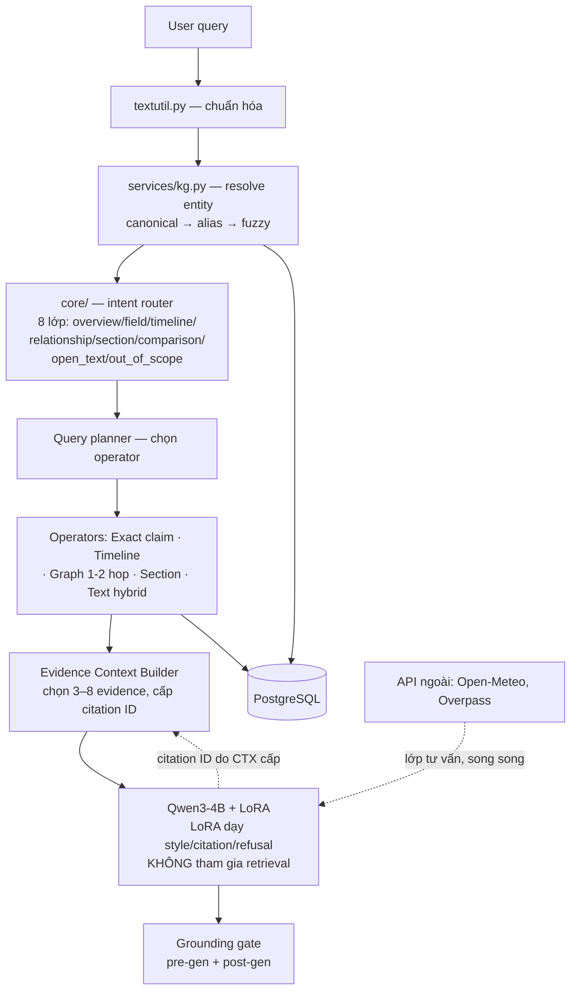
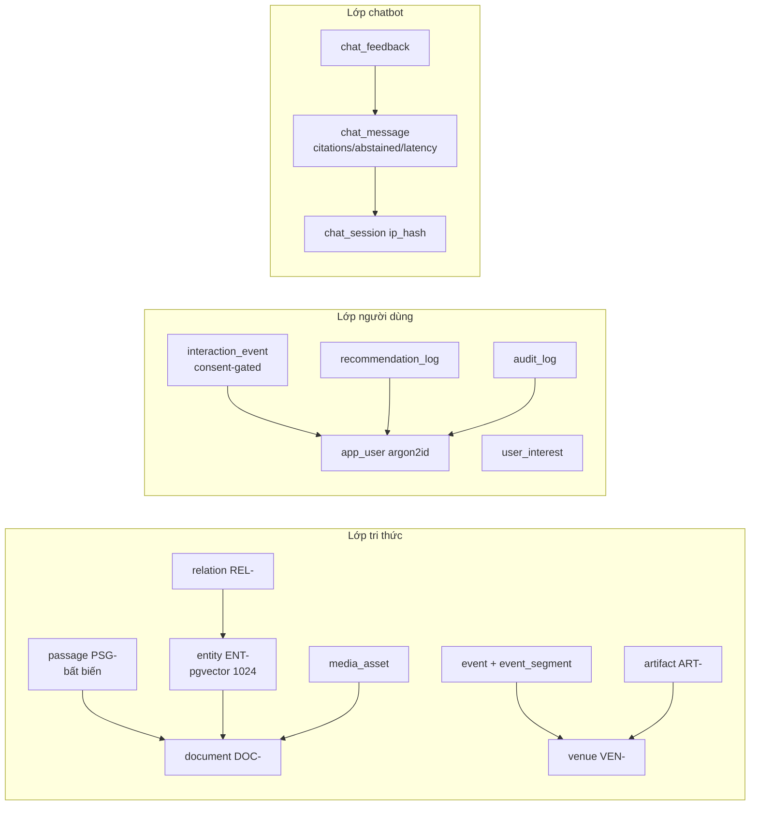

# Architecture Spine — HeritageGraph

## Design Paradigm

**Hexagonal (ports & adapters) over a layered core**, kết hợp **Domain GraphRAG / KAG-lite** cho phần chatbot (theo `docs/chatbot.md` — tài liệu chuẩn cho kiến trúc chatbot).

Trung tâm là `backend/core/` — domain thuần, không import framework. **Phần chatbot chia 5 lớp deterministic + 1 lớp generation** (xem sơ đồ dưới): query understanding → query planner → retrieval operators → evidence context builder → grounding gate, rồi mới đến Qwen3-4B + LoRA.



**As-built hiện tại khác target:** code đang chạy là pipeline đơn `retriever → rag (3 cổng lexical) → Qwen2.5-3B + LoRA` (xem AD-2/AD-3/AD-7). **chatbot.md là target cần xây** — spine bind target, đánh dấu `[ADOPTED]` những gì code đã có.

**Quy tắc hướng phụ thuộc (là luật, xem AD-1):** `api/` phụ thuộc `core/`; `core/` không import `api/`, `fastapi`, hay client DB/HTTP trực tiếp. **Đối tượng thẻ (lớp tư vấn) không bao giờ đi qua lớp sinh văn bản** (chatbot.md §2). Endpoint `/api/chat` chỉ validate/serialize — không chứa SQL, retrieval, planning, prompt hay citation validation.

**Quy tắc hướng phụ thuộc (là luật, xem AD-1):** `api/ → core/` một chiều; `core/` không bao giờ import `api/` hay FastAPI; mọi tài nguyên ngoài vào qua adapter, không qua import thẳng vào core.

## Invariants & Rules

### AD-1 — Hướng phụ thuộc một chiều

- **Binds:** all
- **Prevents:** hai builder độc lập đưa framework/IO vào core, hoặc core gọi ngược router — tạo 2 đường phụ thuộc không thể ghép
- **Rule:** `api/` phụ thuộc `core/`; `core/` không import `api/`, `fastapi`, hay bất kỳ client DB/HTTP nào trực tiếp. Tất cả IO (file corpus, model weights, PG, API ngoài) đi qua adapter với interface khai báo trong core. Kiểm bằng grep: `core/` phải trong suốt với `fastapi`.

### AD-2 — Query planner + retrieval operators (target chatbot.md)

- **Binds:** FR12, FR24, EP-5
- **Prevents:** một pipeline cố định áp cho mọi câu — câu "giá vé bao nhiêu" đi BM25 thay vì claim lookup, trả số bịa
- **Rule:** Intent router (8 lớp: `overview`/`field`/`timeline`/`relationship`/`section`/`comparison`/`open_text`/`out_of_scope`) chọn **operator**, không phải một search cho mọi câu:
  - **Exact** — claim canonical (giá vé, năm khởi lập, kích thước); **không dùng vector để đoán giá trị có cấu trúc**
  - **Timeline** — lọc event theo entity/thời gian
  - **Graph** — 1–2 hop qua predicate allowlist
  - **Section** — narrative section + passages chứng minh
  - **Text** — BM25 từ (k1=1.5, b=0.75) + BM25 char-4-gram (k1=1.2, b=0.6) + RRF k=60; dense vector **chỉ nếu eval chứng minh** (xem Deferred)
  - **Multi-operator plan** — tổ hợp cho câu phức
- **[ADOPTED] as-built core giữ lại:** `retriever.py` BM25×2 + RRF + graph rerank (GRAPH_WEIGHT=0.35, NAMED_DOC_BONUS=0.8, CHUNK_ENTITY_BONUS=0.15, CANDIDATES=30, INJECT_PER_DOC=5, HEADING_WEIGHT=3) là phần Text + Graph operator. `query_intent()` hiện có 5 nhãn (location/time/verify/ward/general) — nâng lên 8 lớp.

### AD-3 — Hai lớp gate: pre-generation + post-generation

- **Binds:** FR14, FR15, NFR07, EP-5
- **Prevents:** model sinh citation không thuộc evidence package, hoặc khẳng định khi evidence không đủ
- **Rule:**
  - **Pre-generation gate:** entity đã resolve (`in_scope=true`, `entry_status` phục vụ), query plan hợp lệ, evidence vượt ngưỡng intent, dữ liệu biến động chưa hết hạn (`valid_until`), evidence thuộc đúng corpus_version.
  - **Post-generation gate:** citation ID chỉ thuộc evidence package; mọi số/ngày có trong evidence; câu factual có citation; mức chắc chắn không cao hơn nguồn; xung đột nguồn không che giấu; lỗi format retry **một lần**.
  - Response có đúng một trạng thái: `answered` / `clarify` / `abstained`.
- **[ADOPTED] as-built:** 3 cổng lexical trong `rag.py` (REQUIRE_GRAPH_ANCHOR, MIN_COVERAGE=0.25, REQUIRE_EVIDENCE_FOR_NAMED, REQUIRE_SUBJECT_EVIDENCE, REQUIRE_KNOWN_ADMIN) trở thành pre-generation gate của **Text operator**. Context ≤2 chunk nối liền ≤2200 ký tự (giữ cho đến khi Evidence Builder thay).

### AD-4 — Trích xuất deterministic, không LLM [ADOPTED]

- **Binds:** FR04, FR05, NFR14, EP-1 / EP-2 nhánh A / EP-4
- **Prevents:** builder dùng LLM extract entity — tạo đỉnh có thể bịa, phá phương châm "mọi đỉnh truy về chuỗi nguyên văn"
- **Rule:** Đồ thị do `kg.py` dựng: thực thể từ curated index + mẫu "danh từ loại + tên riêng" tiếng Việt (≥2 lần xuất hiện), năm bằng regex. Node id `kind:value` (`doc:`/`entity:`/`region:`/`category:`/`year:`). Edge predicates **closed vocab** với trọng số: `is_about` 3.0, `in_region`/`in_category` 1.0, `in_ward` 2.0, `mentions` ≤5, `year` ≤3, `related` ≤5. Mỗi đỉnh phải truy được một chuỗi CÓ THẬT trong nguồn.

### AD-5 — Chunker đơn nhất [ADOPTED]

- **Binds:** FR02, FR12, EP-1 / EP-4
- **Prevents:** hai đường chunk khác nhau khiến đoạn `Nguồn:` lúc train khác hình dạng lúc serve
- **Rule:** `backend/core/corpus.py` là chunker DUY NHẤT (MAX_CHUNK_CHARS=1200, MIN_CHUNK_CHARS=200, MIN_DOC_CHARS=800), dùng chung training + serving. Chunk id `<tên bài>#<i>`; `#0` là lead chunk. `ingestion/chunk_corpus_mt.py` (700/80) + `graphrag/input/` là legacy — **xóa, không tái sinh**.

### AD-6 — Prompt & citation contract [ADOPTED]

- **Binds:** FR15, FR16, NFR05, EP-5
- **Prevents:** builder đổi định dạng prompt khiến checkpoint LoRA đã train không còn khớp
- **Rule:** `prompt.py` là nguồn sự thật duy nhất. **Target (chatbot.md §11):** input là evidence package có citation ID do Context Builder cấp — `"[P17] …\n[P21] …\nCâu hỏi: …"`, luật "chỉ dùng evidence bên dưới, mỗi khẳng định phải có citation". Sinh ở `temperature 0–0.2`, `MAX_TOKENS=768`. **[ADOPTED] as-built hiện tại:** `user_msg` = `"Nguồn: {source|'(không có)'}\n\nCâu hỏi: {question}"` với citation `[Nguồn: <câu nguyên văn> — <url>]` — giữ cho Qwen2.5-3B đến khi迁移 sang Qwen3-4B + citation-ID. Đính chính giả định sai phải ở **câu đầu** (FR16).

### AD-7 — Model: Qwen3-4B + LoRA (target), base+adapter không fused

- **Binds:** FR14, EP-2 nhánh A
- **Prevents:** serve model fused — requantize 4-bit đảo 3/5 câu tiêu cực; hoặc dùng LoRA để tham gia retrieval (nhầm vai trò)
- **Rule:** **Target:** `Qwen/Qwen3-4B` + LoRA adapter (`models/peft-adapter/`, eval_loss 0.3495, checkpoints 125/175/180). **LoRA chỉ dạy cách trả lời** — văn phong, định dạng citation, cách từ chối; **không bao giờ tham gia retrieval/vector**. **[ADOPTED] as-built:** đang serve `mlx-community/Qwen2.5-3B-Instruct-4bit` + `models/lora-serve/` (checkpoint `0000200`, val loss 0.414) — migration Qwen3-4B là việc của Epic 2 nhánh A. Serving dạng **base+adapter**, không fused (`models/qwen-fused/` chỉ cho training/bootstrap). Backend qua `INFERENCE_BACKEND` ∈ {`mlx`, `llama_server`, `llama_cpp`}; docker dùng `llama_server`.

### AD-8 — Phân tách hai đường truy vấn

- **Binds:** FR24, NFR01, NFR03, EP-5 / EP-4
- **Prevents:** builder dời retrieval vào DB thêm RTT mạng, phá p95 <50ms; hoặc dồn /api/graph vào RAM mất persistence
- **Rule:** `/api/chat` → index dựng trong RAM (`@lru_cache get_retriever()`, load 0.23s). `/api/graph` → đọc PostgreSQL (persist qua restart). **Mất PG → `/api/graph` trả 503 kèm message hướng dẫn restart docker — suy giảm tường minh, không silent.**

### AD-9 — Persistence spine: schema.sql v2 + pgvector

- **Binds:** FR01–FR03, FR25, FR26, EP-3 / EP-4 / EP-9
- **Prevents:** mỗi epic tự tạo bảng riêng, trùng lặp thực thể, hai owner cho một entity
- **Rule:** `schema.sql` v2 (16 bảng, 4 lớp: Admin / Knowledge / 3D-CMG / Chatbot) là **binding persistence spine**. Bật `pgvector` cho `passage_embedding vector(1024)`. Các bảng PRD mới (`app_user` argon2id, `user_interest`, `interaction_event`, `recommendation_log`, `venue`, `event`, `event_segment`, `artifact`, `poi`, `media_asset`) thêm vào **cùng lớp và cùng quy ước**, không tạo schema song song. Tầng DB hiện vắng mặt (chỉ bytecode cũ) — xây mới;Alembic quản lý migration từ bảng đầu tiên.

### AD-10 — Quy ước id

- **Binds:** NFR13, EP-4 / EP-9
- **Prevents:** builder chọn UUID trong khi nghiệp vụ cần id đọc được để trích nguồn
- **Rule:** Bảng **lớp tri thức** dùng `TEXT '<PREFIX>-<NNNNNN>` (sequence cấp, không `max+1`): `DOC-`, `PSG-`, `ENT-`, `REL-`, `VEN-`, `EVT-`, `ART-`. Bảng **log** dùng `BIGSERIAL` (`audit_log`, `chat_message`, `chat_feedback`, `interaction_event`). Giữ nguyên id đồ thị `kind:value` và chunk `<bài>#<i>`. `schema.sql` hiện dùng UUID → **supersede** bởi AD này.

### AD-11 — Provenance ở mức DB (không phải app) [ADOPTED]

- **Binds:** FR03, FR18, FR29, NFR14, NFR13, EP-4 / EP-7
- **Prevents:** bản ghi thiếu nguồn lọt qua vì validation chỉ ở tầng app (có thể bỏ qua)
- **Rule:** Mọi bảng bản ghi (`venue`, `event`, `event_segment`, `artifact`, `media_asset`) ràng buộc `NOT NULL source_url + source_sentence` **ở mức DB** kèm lỗi mức trường. Thẻ tư vấn (FR18) chỉ chứa trường bản ghi nguồn hoặc phản hồi API có tên + `fetched_at` + `provenance`; **assert tự động 0 trường bịa (NFR06)**. Script audio (FR30) phải qua kiểm tra bằng chứng trước khi tổng hợp giọng nói — nếu không đạt, **chặn tổng hợp**.

### AD-12 — Consent trước khi ghi; xuất/xóa không thể cắt

- **Binds:** FR08, FR25, NFR12, EP-3 / EP-6
- **Prevents:** builder ghi interaction_event trước đồng ý — biến dữ liệu cá nhân thành nghĩa vụ
- **Rule:** `interaction_event` chỉ ghi **sau** consent có thông báo. Chỉ lưu tối thiểu (ip_hash, không IP thô). `POST /api/me/export` xuất tệp máy đọc được; `DELETE /api/me/data` xóa cả hồ sơ + interaction_event. Hai endpoint này **không được cắt** trong bất kỳ lần cắt phạm vi nào.

### AD-13 — Checkpoint serve cố định

- **Binds:** FR27, NFR16, EP-2 nhánh A / EP-9
- **Prevents:** serve checkpoint khác làm số liệu đo không tái lập
- **Rule:** Mỗi lineage có một checkpoint serve cố định, ghi vào `CHECKPOINT` (single source of truth):
  - **Qwen2.5-3B lineage:** `0000200` (val loss 0.414, NER micro-F1 0.7861) — fix drift hiện tại (`lora-serve/CHECKPOINT` đang ghi `0000400`).
  - **Qwen3-4B lineage:** checkpoint tốt nhất của `models/peft-adapter/` (eval_loss 0.3495, checkpoint 180) — chốt lại khi Epic 2 nhánh A hoàn thành.
  - Đổi checkpoint = đổi phiên bản model, phải ghi lại vào mọi report.

### AD-14 — Binding demo 127.0.0.1

- **Binds:** NFR11, EP-10
- **Prevents:** demo mở mạng công khai
- **Rule:** Demo local bind `127.0.0.1` (sửa `config.py` `BACKEND_HOST` chết hiện tại). Container bind `0.0.0.0` là internal; **port mapping** trong docker-compose kiểm soát exposure. CORS `allow_origins` giới hạn frontend origin (giữ `localhost:3000`/`127.0.0.1:3000`).

### AD-15 — Hợp đồng kiểm thử & tái lập

- **Binds:** FR27, NFR16, EP-9 / EP-10
- **Prevents:** report không tái lập được — mất truy vết mô hình/checkpoint/corpus
- **Rule:** Backend unit test dùng **unittest** (stdlib) — reality, không đổi sang pytest. E2E mới dùng **Playwright**. Eval harness (`eval/`) chạy độc lập, mỗi report mang metadata SHA-256 (gold, prompt, corpus, adapter, scorer) — đây là cơ chế NFR16. Test regression-style, đặt tên theo hành vi.

### AD-16 — Degradation thay vì crash [ADOPTED]

- **Binds:** NFR20, NFR18, EP-7 / EP-10
- **Prevents:** builder raise exception làm trang trắng khi API ngoài chết
- **Rule:** Lỗi retrieval → context rỗng → refusal đã train. API ngoài chết → thẻ ghi "không có dữ liệu dự báo", không đoán. Mất R2/Azure → trang chi tiết vẫn đầy đủ text/transcript, 3D+audio hiện "tạm thời không khả dụng". `HTTPException` với `detail` tiếng Việt. **Fail-fast `RuntimeError` lúc import** cho silent-corruption (mismatch classifier trong `kg.py`/`nerlabel.py`); `FileNotFoundError` với lệnh sửa cụ thể.

### AD-17 — Tích hợp ngoài song song + suy giảm tường minh

- **Binds:** FR20, FR21, NFR02, EP-7
- **Prevents:** gọi API ngoài tuần tự kéo p95 qua 2 giây
- **Rule:** Open-Meteo + Overpass gọi **song song** với bước sinh qua `asyncio.gather` để ẩn độ trễ. Cache POI vào bảng `poi` (source `osm|manual`). Lễ xa >16 ngày → khí hậu trung bình cùng kỳ, thẻ ghi rõ "khí hậu, không phải dự báo". Suy giảm là **ca kiểm thử bắt buộc**, không phải afterthought.

## Consistency Conventions

| Concern | Convention |
| --- | --- |
| Naming — Python | `snake_case` module/function; `PascalCase` class; `SCREAMING_CASE` hằng số; `_prefix` private |
| Naming — file | `lowercase.py` trong gói lớp (`core/`, `api/`); frontend `PascalCase.tsx` component, `camelCase` props/handler |
| Naming — id | Đồ thị `kind:value`; chunk `<bài>#<i>`; DB lớp tri thức `<PREFIX>-<NNNNNN>`; DB log `BIGSERIAL` (xem AD-10) |
| Naming — data artifact | `train.jsonl`/`valid.jsonl` (mlx_lm mandate); backup `.bak-YYYYMMDD-HHMMSS` / `.old`; vòng generation suffix `_v3`/`ner_`/`verify_` |
| Data & formats | Response JSON envelope: endpoint dùng schema inline, chat dùng `ChatResponse`; source dict `{text, score, doc, heading, url, chunk_id, graph, graph_hits, used_in_context}`; ngày `TIMESTAMPTZ` |
| State & mutation | `passage.text` **bất biến** (không UPDATE); mọi `CHECK` ngữ nghĩa ở DB; `publication_state` không default `published` |
| Error | `HTTPException` detail tiếng Việt; 400/404/500/503 ngữ nghĩa; degrade không crash (AD-16) |
| Config | `backend/core/config.py` path constants + `os.environ.get` có default tại use site + `training/lora_config.yaml`; flag retrieval qua `RT_*`; tuyệt đối không commit secret (PG password từ `.env`) |
| Logging | `log.exception` cho degradation; audit_log cho hành động admin (before/after payload) |
| Git | Conventional Commits (`feat(scope):`, `fix:`, `test:`) |

## Stack

| Name | Version |
| --- | --- |
| Python | 3.12 (backend/.venv) |
| FastAPI | >=0.110.0 |
| uvicorn[standard] | >=0.27.0 |
| pydantic | >=2.0 |
| httpx | >=0.27.0 |
| networkx | >=3.0 |
| mlx-lm / mlx | >=0.20.0 (Mac; bản docker bỏ) |
| PostgreSQL | 16 + pgvector 0.8.6 (mục tiêu — chưa có) |
| Alembic | mới (quản lý migration) |
| Base model (target) | Qwen/Qwen3-4B + LoRA r=16 (models/peft-adapter/, eval_loss 0.3495) |
| Base model (as-built) | mlx-community/Qwen2.5-3B-Instruct-4bit + LoRA r=16 (lora-serve/, ckpt 0000200) |
| llama.cpp server | ghcr.io/ggml-org/llama.cpp:server (docker) |
| Next.js | 14.2.0 |
| React | 18.3 |
| @ant-design/x | ^2.9.0 (XProvider darkAlgorithm) |
| TypeScript | ^5.0 |
| Playwright | mới (E2E) |

## Structural Seed

```text
HeritageGraph/
  backend/
    api/            # driving adapters: chat.py, graph.py, health.py (prefix /api) — chỉ validate/serialize
    core/           # domain thuần: textutil, retriever, rag, kg, llm, corpus, prompt, nerlabel, fuzzy_match, config
                    #   + intent router & query planner (mới — chatbot.md §14)
    db/             # MỚI: psycopg repository (chỉ /api/graph + CRUD), pgvector
    services/       # MỚI: entity resolution (kg resolver), card generators (registry intent→card), recommend, profile, chat orchestration
    tests/          # unittest regression
  frontend/
    app/            # route: /chat (+ /explore/[node], /account, /dashboard sau này)
    components/     # ChatView, ChatInput, ChatActions, Suggestion, TopBar, Landing, Logo/
    types/chat.ts   # Source + Message (cần mở rộng cho blocks/intent/recommendations)
    lib/            # MỚI: api client (hiện rỗng)
  corpus/           # wiki_by_location/*.txt, locations_index.json (index duy nhất), aliases.json
  models/           # lora-serve/ (serve), lora-adapter/, qwen-fused/ (train only), CHECKPOINT
  ingestion/        # crawl_wiki, crawl_by_location, fetch_aliases (xóa chunk_corpus_mt)
  training/         # bootstrap_*, lora_config.yaml, train.sh, fuse.sh, select_adapter.sh
  eval/             # eval_retrieval, eval_attribution, make_gold_template, gold.jsonl, report_*.json
  graphrag/output/  # graph.json/gexf/stats.json (artifact, build qua scripts/build_graph.py)
  scripts/          # build_graph, run_indexing, start_dev, export_gguf, package_docker
  schema.sql        # v2 — binding persistence spine (AD-9), mở rộng thêm bảng PRD
  docker-compose.yml # 3 services: llm (llama.cpp), backend, frontend
```



## Capability → Architecture Map

| Capability / Area | Lives in | Governed by |
| --- | --- | --- |
| FR01/FR25 tài khoản & riêng tư | `api/` (auth middleware) + `db/` + frontend `/account` | AD-9, AD-11, AD-12, AD-14 |
| FR02–FR06 corpus & bản ghi | `ingestion/` + `core/corpus.py` + `db/` CRUD | AD-4, AD-5, AD-9, AD-10, AD-11 |
| FR12/FR24 truy hồi & planner | `core/retriever.py` (Text/Graph operator) + `core/` intent router/planner (mới) + `passage_embedding` pgvector | AD-2, AD-3, AD-8 |
| FR14–FR16 trả lời có căn cứ | `core/rag.py` (Evidence Builder + gates) + `core/llm.py` + `core/prompt.py` | AD-3, AD-6, AD-7, AD-16 |
| FR07–FR13 cá nhân hóa | `services/recommend.py` + `user_interest`/`interaction_event` | AD-12, công thức recommend (epics.md) |
| FR17–FR22 thẻ tư vấn | `services/` card registry + external adapters | AD-11, AD-17 |
| FR23/FR28–FR30 trang chi tiết & multimedia | frontend `/explore/[node]` + `media_asset` + R2/Azure | AD-11, AD-16 |
| FR26/FR27 dashboard & đánh giá | `api/` admin routers + `eval/` | AD-13, AD-15 |
| NFR01–NFR03 hiệu năng | RAM index + asyncio.gather + đo liên tục | AD-2, AD-8, AD-17 |

## Deferred

- **Kênh dense vector**: chatbot.md đặt **có điều kiện** — "dense vector cho paraphrase **chỉ nếu eval chứng minh có lợi**". Spike trước (dense top-3 ≥70% trên PARAPHRASE), mới quyết xây. θ hiệu chỉnh trên OUT_OF_DOMAIN nếu xây. Khi chốt → nâng thành AD.
- **`<model-viewer>` vs Three.js** cho 3D (FR28): chọn Tuần 10 theo tài sản thực có; không chốt trước.
- **POI fallback soạn tay**: kiểm độ phủ OSM đầu Tuần 8 (Nam Ô, Bảo tàng Chăm); thưa thì fallback, luật cụ thể chưa viết.
- **Streaming cho `/api/chat`**: chỉ nếu p95 vượt 8s sau khi đo; mặc định không stream.
- **Mở rộng vùng thứ ba (Nam Bộ)**: cơ chế độc lập vùng đã có (bảng đối chiếu), dữ liệu phải crawl lại + sinh lại eval — không trong phạm vi v1.
- **Người đánh giá thứ hai** (precision@5 + Cohen's κ, NER gold): chưa chốt ai; là blocker cho SM-6/SM-9.
- **Stale artifact cleanup** (AD-16 đang thực thi qua memlog): xóa `.bak`, `graphrag/prompts/` rỗng, `frontend/lib/` rỗng, `backend/models/qwen2.5-7b/` legacy, `backend/package-lock.json`, `metadata.ts` branding sai, trùng `report_base*.json`, thống nhất số địa điểm curated (49/47/45) về một index.
